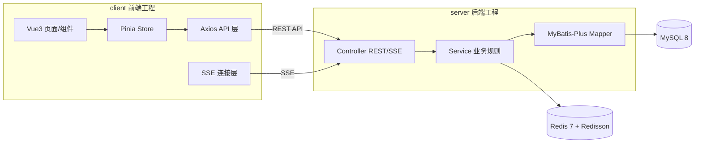

# SeatWise Campus · 智能校园自习室预约管理平台

> 面向高校多校区、多楼栋、多楼层场景的 C/S 架构自习室在线预约系统。
> 提供在线选座、限时预约、签到、超时释放、爽约黑名单、实时座位热力图、统计报表，并预留积分排名与附近空位推荐能力。

---

## 一、项目简介

SeatWise Campus（智能校园自习室预约管理平台）是一套经典 **C/S（Client / Server）** 架构的高校自习室预约系统。学生通过客户端在线选座并限时预约，到达后签到；管理员维护校区、楼栋、楼层、自习室与座位排布，并查看实时看板与统计报表。

- 项目英文名：**SeatWise Campus**
- 项目中文名：**智能校园自习室预约管理平台**
- 架构风格：**C/S 架构**，工程主体拆分为 `client/`（前端）与 `server/`（后端）两个主要工程。
- 当前阶段：**文档与 Agent 指令阶段**，尚未实现业务代码。

---

## 二、核心痛点

| 编号 | 痛点 | SeatWise Campus 的应对 |
| --- | --- | --- |
| P1 | 学生不知道哪里有空位 | 实时座位热力图 + 附近空位推荐（NearestAvailableRoom） |
| P2 | 线下占座严重 | 线上限时预约 + 座位状态实时同步 |
| P3 | 到自习室才发现没座位，浪费时间 | 预约成功锁定座位 + 到达后签到 |
| P4 | 管理员无法掌握使用率 | 统计报表（使用率、热门时段、取消率、爽约率、利用率排行） |
| P5 | 座位状态更新不及时 | 初始化快照 + SSE 增量推送 |
| P6 | 爽约、长期占位、超时不签到影响公平 | 超时自动释放 + 爽约黑名单 + 积分激励 |

---

## 三、核心功能

- **自习室管理**：校区 / 楼栋 / 楼层 / 自习室 / 开放时间 / 座位排布 / 座位启用禁用。
- **学生预约**：按校区-楼栋-楼层-自习室筛选，查看空位，选时间片，网格选座，提交预约，查看预约记录。
- **座位管控**：待签到、签到、超时释放、主动取消、爽约计数、黑名单。
- **实时看板**：座位热力图，多客户端实时同步（初始化快照 + SSE 增量推送）。
- **数据报表**：日均使用率、热门时段、取消率、爽约率、利用率排行。
- **积分排名（MVP+）**：守约加分、爽约扣分、排行榜。
- **附近空位推荐（MVP+）**：按距离 + 空位数 + 开放状态推荐自习室。
- **AI 推荐 / 通知提醒（后续扩展）**：仅设计接口与文档，不要求实现。

功能详细分级见 [`docs/04-mvp-scope.md`](docs/04-mvp-scope.md)。

---

## 四、技术栈

### 后端（server）
| 类别 | 选型 |
| --- | --- |
| 语言 / 运行时 | JDK 21 |
| Web 框架 | Spring Boot 3.5.x |
| ORM | MyBatis-Plus |
| 数据库 | MySQL 8 |
| 缓存 / 锁 / 延迟队列 | Redis 7 + Redisson |
| 认证鉴权 | Sa-Token |
| API 文档 | Knife4j |
| 部署 | Docker Compose |

### 前端（client）
| 类别 | 选型 |
| --- | --- |
| 框架 | Vue 3 |
| 构建 | Vite |
| UI 组件库 | Element Plus |
| 图表 | ECharts |
| HTTP | Axios |
| 状态管理 | Pinia |
| 路由 | Vue Router |

---

## 五、C/S 架构说明



**边界原则（全项目强一致约束）：**

- 前端 **不直接访问数据库**，只通过 REST API 和 SSE 与后端通信。
- 后端负责**业务规则、并发控制、权限控制、数据一致性**。
- MySQL 是**主存储与最终正确性来源**；Redis 用于缓存、分布式锁、座位状态缓存、延迟释放任务。
- **座位是否可预约的最终结论只能由后端给出**，前端交互校验仅用于体验优化。

详见 [`docs/02-system-architecture.md`](docs/02-system-architecture.md)。

---

## 六、client / server 目录说明

```
.
├── README.md              项目入口（本文件）
├── AGENTS.md              通用 Coding Agent 规则
├── CLAUDE.md              Claude Code 规则
├── llms.txt               LLM 文档索引
├── PROJECT_CONTEXT.md     项目全局上下文
├── ROADMAP.md             开发路线图 P0-P9
├── GLOSSARY.md            统一术语表
├── docs/                  跨端通用文档（需求/架构/流程/MVP/扩展/演示/验收）
├── client/                前端客户端工程文档目录
└── server/                后端服务端工程文档目录
```

> 说明：虽然本系统是 C/S 架构、工程主体分为 `client` 与 `server`，但为便于 LLM 读取跨端文档，额外提供 `docs/` 存放通用架构、需求、流程与扩展设计。`client` 与 `server` 仍是两个主要工程目录。

---

## 七、MVP 范围

MVP 必须完成：登录、学生预约、自习室基础管理、座位排布、并发防重复预约、签到、超时释放、黑名单、实时热力图、基础报表。

MVP+：积分排名、最近空位推荐。

后续扩展：AI 推荐、通知提醒、校园地图、移动端/小程序、管理端规则配置。

完整分级见 [`docs/04-mvp-scope.md`](docs/04-mvp-scope.md)。

---

## 八、推荐开发顺序

1. **P0** 文档与脚手架（当前阶段）。
2. **P1** 登录与基础数据管理（校区/楼栋/楼层/自习室）。
3. **P2** 座位排布与查询。
4. **P3** 核心预约（时间片 + Redisson 锁 + 唯一索引兜底）。
5. **P4** 签到、超时释放、黑名单。
6. **P5** 实时热力图（快照 + SSE）。
7. **P6** 数据报表。
8. **P7** 积分排名（MVP+）。
9. **P8** 最近空位推荐（MVP+）。
10. **P9** AI 推荐与通知提醒（后续）。

详见 [`ROADMAP.md`](ROADMAP.md)。

---

## 九、文档索引

| 分类 | 文档 | 说明 |
| --- | --- | --- |
| 入口 | [README.md](README.md) | 项目入口 |
| Agent | [AGENTS.md](AGENTS.md) / [CLAUDE.md](CLAUDE.md) / [llms.txt](llms.txt) | Agent 规则与索引 |
| 全局 | [PROJECT_CONTEXT.md](PROJECT_CONTEXT.md) / [ROADMAP.md](ROADMAP.md) / [GLOSSARY.md](GLOSSARY.md) | 上下文/路线图/术语 |
| 通用 | [docs/](docs/) | 需求、架构、流程、MVP、扩展、演示、验收 |
| 前端 | [client/](client/) | 客户端设计与实现指南 |
| 后端 | [server/](server/) | 服务端设计与实现指南 |

> **当前阶段仅生成文档，不实现业务代码。** 代码实现请按 `ROADMAP.md` 分阶段进行，并遵守 `AGENTS.md` / `CLAUDE.md` 约束。
