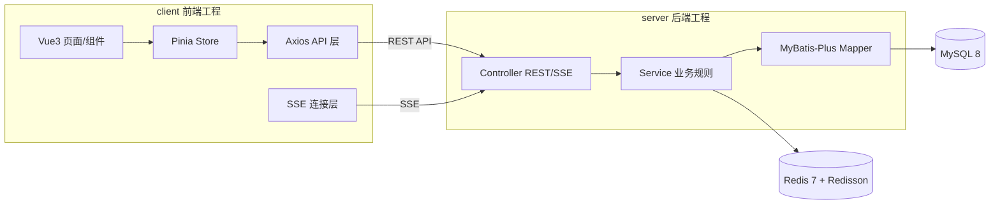

# SeatWise Campus · 智能校园自习室预约管理平台

> 面向高校多校区、多楼栋、多楼层场景的 C/S 架构自习室在线预约系统。
> 提供在线选座、限时预约、签到、超时释放、爽约黑名单、实时座位热力图、统计报表，并预留积分排名与附近空位推荐能力。

---

## 一、项目简介

SeatWise Campus（智能校园自习室预约管理平台）是一套经典 **C/S（Client / Server）** 架构的高校自习室预约系统。学生通过客户端在线选座并限时预约，到达后签到；管理员维护校区、楼栋、楼层、自习室与座位排布，并查看实时看板与统计报表。

- 项目英文名：**SeatWise Campus**
- 项目中文名：**智能校园自习室预约管理平台**
- 架构风格：**C/S 架构**，工程主体拆分为 `client/`（前端）与 `server/`（后端）两个主要工程。
- 当前阶段：**已完整实现并可一键运行**（Docker Compose）。MVP + MVP+ 全部落地，另有 9 项增强功能（见下）。

---

## 二、核心痛点

| 编号 | 痛点 | SeatWise Campus 的应对 |
| --- | --- | --- |
| P1 | 学生不知道哪里有空位 | 实时座位热力图 + 附近空位推荐（NearestAvailableRoom） |
| P2 | 线下占座严重 | 线上限时预约 + 座位状态实时同步 |
| P3 | 到自习室才发现没座位，浪费时间 | 预约成功锁定座位 + 到达后签到 |
| P4 | 管理员无法掌握使用率 | 统计报表（使用率、热门时段、取消率、爽约率、利用率排行） |
| P5 | 座位状态更新不及时 | 初始化快照 + SSE 增量推送 |
| P6 | 爽约、长期占位、超时不签到影响公平 | 超时自动释放 + 爽约黑名单 + 积分激励 |

---

## 三、核心功能

- **自习室管理**：校区 / 楼栋 / 楼层 / 自习室 / 开放时间 / 座位排布 / 座位启用禁用。
- **学生预约**：按校区-楼栋-楼层-自习室筛选，查看空位，选时间片，网格选座，提交预约，查看预约记录。
- **座位管控**：待签到、签到、超时释放、主动取消、爽约计数、黑名单。
- **实时看板**：座位热力图，多客户端实时同步（初始化快照 + SSE 增量推送）。
- **数据报表**：日均使用率、热门时段、取消率、爽约率、利用率排行。
- **积分排名（MVP+）**：守约加分、爽约扣分、排行榜。
- **附近空位推荐（MVP+）**：按距离 + 空位数 + 开放状态推荐自习室。

功能详细分级见 [`docs/04-mvp-scope.md`](docs/04-mvp-scope.md)。

### 增强功能亮点（已实现）

在 MVP/MVP+ 之上落地 9 项增强，规划与验收见 [`docs/12-enhancement-plan.md`](docs/12-enhancement-plan.md)：

| # | 功能 | 一句话 |
| --- | --- | --- |
| ① | AI 智能选座助手 | 自然语言 → 意图 → 可解释推荐；接入 DeepSeek（OpenAI 兼容），离线自动降级规则引擎 |
| ② | 临时锁座与倒计时 | 点座即用 Redis TTL 保留 90 秒，SSE 广播「选择中」，到期自动释放 |
| ③ | 站内通知中心 | 积分/黑名单/候补等事件每用户 SSE 实时推送并留存，写明原因 |
| ④ | 管理端实时事件流 | 座位事件带时间戳滚动展示，点击定位 |
| ⑤ | 冲突后智能替代 | 抢座失败即时给出相邻/同房间替代座位，一键改约 |
| ⑥ | 首页数据概览 | 学生端/管理端登录概览卡片 + ECharts 图表 |
| ⑦ | 候补队列（自动补位闭环） | 满员一键候补；释放即自动保留 60 秒并推送，倒计时内确认，超时顺延 |
| ⑧ | 组队相邻预约（原子多座） | 一次为多人预约相邻座位，全部成功或整体回滚——演示分布式并发原子性 |
| ⑨ | 座位历史回放 | 拖动播放条重建当天占用轨迹，利用率仪表盘 + 曲线定位最拥挤时刻 |
| ⑩ | 公告中心 | 管理员发布系统公告，学生首页横幅展示，可选一并推送站内通知 |
| ⑪ | 预约提醒 | 定时任务在开始前/签到开放时推送提醒（Redis 去重、幂等） |
| ⑫ | 个人自习报告 | 累计时长/场次、连续天数、守约率、近 7 天时长图（ECharts 聚合） |
| ⑬ | 时空座位图 | 时间轴拖动选开始时刻，座位按「连续可用时长」绿色渐变发光，空间+时间联合查询 |
| ⑭ | 深色模式 + 微交互 | 一键明暗主题、极光玻璃登录、数字滚动、成功彩带、路由过渡 |

---

## 三之二、快速启动与演示导览

### 一键启动（Docker Compose）

```bash
# 可选：配置 AI 助手（不配则走离线规则引擎）
#   在项目根目录创建 .env（已被 .gitignore 忽略，切勿提交）
#   AI_BASE_URL=https://api.deepseek.com/v1
#   AI_API_KEY=sk-xxxx
#   AI_MODEL=deepseek-v4-flash

docker compose up -d --build
# 等到管理员登录返回 code=0 即就绪（首启需初始化 MySQL 与座位网格）
```

访问入口：

| 端点 | 地址 | 说明 |
| --- | --- | --- |
| 前端 | http://localhost:8888 | 学生端 / 管理端 |
| 后端 | http://localhost:18080 | REST / SSE |
| 接口文档 | http://localhost:18080/doc.html | Knife4j |

演示账号（首启由 `DataInitializer` 将明文密码迁移为 BCrypt）：

- 管理员：`admin` / `admin123`
- 学生：`student1`…`student8` / `123456`

### 演示导览（建议顺序）

1. **学生端选座**：筛选自习室 → 网格选座（观察其它端「选择中」黄色倒计时）→ 预约成功。
2. **AI 助手**：右下角助手输入「帮我找个安静靠窗的位置」→ 可解释推荐。
3. **候补队列**：座位满员点「加入候补」；另一端取消 → 候补者收到「席位已保留 60s」通知，一键确认。
4. **组队相邻预约**：选座页开「组队相邻预约」→ 选同排连续座位分配成员 → 一次原子锁定。
5. **管理端实时看板**：另开管理端看座位状态秒级同步 + 实时事件流。
6. **历史回放**：看板页「历史回放」→ 拖动/播放播放条重建当天占用，定位最拥挤时刻
   （演示前可运行 `node scripts/seed-replay.mjs` 生成起伏曲线）。
7. **报表**：管理端数据报表查看利用率/热门时段等 ECharts 图。

### 自动化测试

```bash
node scripts/smoke-test.mjs     # 核心预约闭环 14 项
node scripts/test-hold.mjs      # 临时锁座 8 项
node scripts/test-notify.mjs    # 站内通知 7 项
node scripts/test-fixes.mjs     # 布局生成/黑名单/时间校验等修复 14 项
node scripts/test-extras.mjs    # 积分明细/AI/附近/替代/报表/追踪/黑名单 11 项
node scripts/test-waitlist.mjs  # 候补队列闭环 11 项（需干净库）
node scripts/test-group.mjs     # 组队原子性 7 项（含并发，需干净库）
node scripts/test-replay.mjs    # 历史回放 7 项
node scripts/test-announcement.mjs # 公告中心 9 项
node scripts/test-report-me.mjs # 个人自习报告 8 项
node scripts/test-reminder.mjs  # 预约提醒（含幂等）5 项
```

> 部分脚本会写入数据，建议在干净库上单独运行；重置：`docker compose down -v && docker compose up -d`。

---

## 四、技术栈

### 后端（server）
| 类别 | 选型 |
| --- | --- |
| 语言 / 运行时 | JDK 21 |
| Web 框架 | Spring Boot 3.5.x |
| ORM | MyBatis-Plus |
| 数据库 | MySQL 8 |
| 缓存 / 锁 / 延迟队列 | Redis 7 + Redisson |
| 认证鉴权 | Sa-Token |
| API 文档 | Knife4j |
| 部署 | Docker Compose |

### 前端（client）
| 类别 | 选型 |
| --- | --- |
| 框架 | Vue 3 |
| 构建 | Vite |
| UI 组件库 | Element Plus |
| 图表 | ECharts |
| HTTP | Axios |
| 状态管理 | Pinia |
| 路由 | Vue Router |

---

## 五、C/S 架构说明



**边界原则（全项目强一致约束）：**

- 前端 **不直接访问数据库**，只通过 REST API 和 SSE 与后端通信。
- 后端负责**业务规则、并发控制、权限控制、数据一致性**。
- MySQL 是**主存储与最终正确性来源**；Redis 用于缓存、分布式锁、座位状态缓存、延迟释放任务。
- **座位是否可预约的最终结论只能由后端给出**，前端交互校验仅用于体验优化。

详见 [`docs/02-system-architecture.md`](docs/02-system-architecture.md)。

---

## 六、client / server 目录说明

```
.
├── README.md              项目入口（本文件）
├── AGENTS.md              通用 Coding Agent 规则
├── CLAUDE.md              Claude Code 规则
├── llms.txt               LLM 文档索引
├── PROJECT_CONTEXT.md     项目全局上下文
├── ROADMAP.md             开发路线图 P0-P9
├── GLOSSARY.md            统一术语表
├── docs/                  跨端通用文档（需求/架构/流程/MVP/扩展/演示/验收）
├── client/                前端客户端工程文档目录
└── server/                后端服务端工程文档目录
```

> 说明：虽然本系统是 C/S 架构、工程主体分为 `client` 与 `server`，但为便于 LLM 读取跨端文档，额外提供 `docs/` 存放通用架构、需求、流程与扩展设计。`client` 与 `server` 仍是两个主要工程目录。

---

## 七、MVP 范围

MVP 必须完成：登录、学生预约、自习室基础管理、座位排布、并发防重复预约、签到、超时释放、黑名单、实时热力图、基础报表。

MVP+：积分排名、最近空位推荐。

后续扩展：AI 推荐、通知提醒、校园地图、移动端/小程序、管理端规则配置。

完整分级见 [`docs/04-mvp-scope.md`](docs/04-mvp-scope.md)。

---

## 八、推荐开发顺序

1. **P0** 文档与脚手架（当前阶段）。
2. **P1** 登录与基础数据管理（校区/楼栋/楼层/自习室）。
3. **P2** 座位排布与查询。
4. **P3** 核心预约（时间片 + Redisson 锁 + 唯一索引兜底）。
5. **P4** 签到、超时释放、黑名单。
6. **P5** 实时热力图（快照 + SSE）。
7. **P6** 数据报表。
8. **P7** 积分排名（MVP+）。
9. **P8** 最近空位推荐（MVP+）。
10. **P9** AI 推荐与通知提醒（后续）。

详见 [`ROADMAP.md`](ROADMAP.md)。

---

## 九、文档索引

| 分类 | 文档 | 说明 |
| --- | --- | --- |
| 入口 | [README.md](README.md) | 项目入口 |
| Agent | [AGENTS.md](AGENTS.md) / [CLAUDE.md](CLAUDE.md) / [llms.txt](llms.txt) | Agent 规则与索引 |
| 全局 | [PROJECT_CONTEXT.md](PROJECT_CONTEXT.md) / [ROADMAP.md](ROADMAP.md) / [GLOSSARY.md](GLOSSARY.md) | 上下文/路线图/术语 |
| 通用 | [docs/](docs/) | 需求、架构、流程、MVP、扩展、演示、验收 |
| 前端 | [client/](client/) | 客户端设计与实现指南 |
| 后端 | [server/](server/) | 服务端设计与实现指南 |

> 代码实现请按 `ROADMAP.md` 分阶段进行，并遵守 `AGENTS.md` / `CLAUDE.md` 约束。
