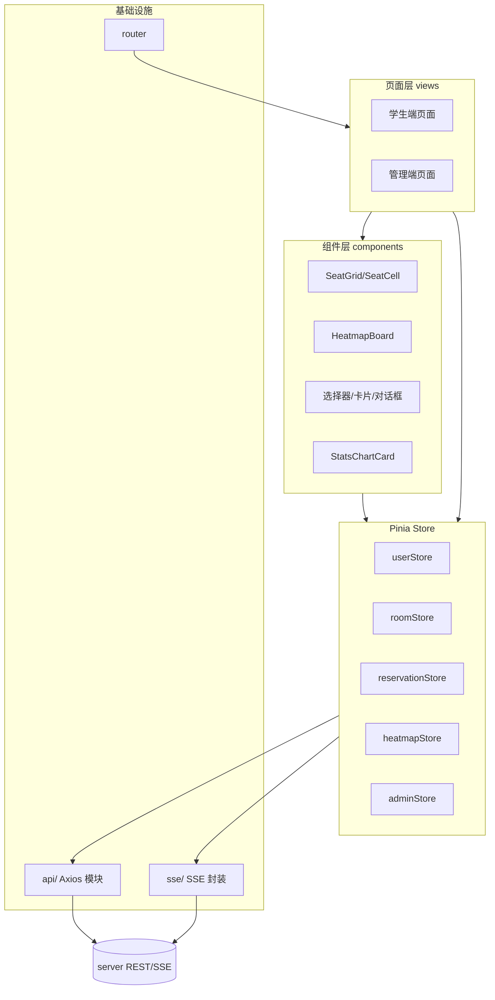

# client/00 · 客户端整体架构

- **文档目的**：描述前端分层与模块关系。
- **适用范围**：`client/` 工程结构。
- **读者对象**：前端/Agent。
- **相关文件**：[01-page-route-map](01-page-route-map.md)、[06-state-management](06-state-management.md)、[07-api-calling-design](07-api-calling-design.md)。

## 关键结论
- 分层：页面层 → 组件层 → Store 层 → API 层 / SSE 层 → 后端。
- 组件不直接调 Axios；数据流经 Store，Store 调 API。

## 一、技术栈
Vue 3 + Vite + Element Plus + ECharts + Axios + Pinia + Vue Router。

## 二、前端模块图


## 三、目录约定（建议）
```
client/src/
├── api/           # 按模块划分的接口封装(auth,room,reservation,board,report,score,nearby)
├── sse/           # SSE 连接与事件分发
├── stores/        # Pinia：user/room/reservation/heatmap/admin(+score/nearbyRoom)
├── components/    # 复用组件
├── views/         # 页面(student/*, admin/*)
├── router/        # 路由与守卫
├── utils/         # 时间片换算、校验、错误码映射
└── main.ts
```

## 四、各层职责
| 层 | 职责 | 禁止 |
| --- | --- | --- |
| 页面层 | 组织页面、绑定 store、路由参数 | 直接调 Axios |
| 组件层 | 展示与交互、emit 事件 | 存全局业务状态 |
| Store 层 | 业务状态、调用 API/SSE、缓存视图数据 | 判定最终正确性 |
| API 层 | 请求封装、token 注入、错误统一处理 | 散落 baseURL |
| SSE 层 | 建连、心跳、重连、事件分发到 store | 覆盖后端事件语义 |
| Router | 路由与角色守卫 | 承载业务逻辑 |

## 五、SSE 连接层
看板页进入时按 `roomId/date/start/end` 建立 SSE，收 `board_snapshot` 初始化，随后按 `seat_*` 事件局部更新 heatmapStore；离开页面断开。详见 [04](04-seat-grid-and-heatmap.md)。

## 实现约束
- 组件通过 store 获取数据；跨页共享状态放 store。
- 时间片换算等纯逻辑放 `utils`，前后端口径一致（30 分钟片）。

## 验收标准
- 数据流可追踪：页面→store→api/sse→后端，无组件直连 Axios。

## 给 AI Coding Agent 的提示
新增功能先确定落在哪一层；不要把 API 调用写进组件；SSE 事件处理集中在 heatmapStore。
