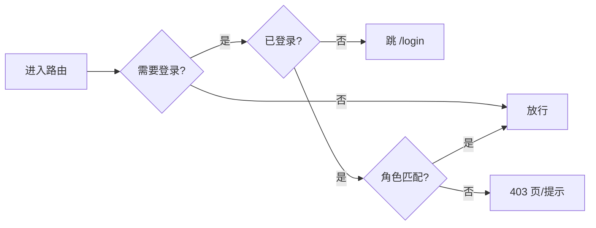

# client/01 · 页面与路由表

- **文档目的**：定义全部页面、路由、访问角色、目标、组件、接口与异常状态。
- **适用范围**：`client` 路由。
- **读者对象**：前端/Agent。
- **相关文件**：[02-student-side-design](02-student-side-design.md)、[03-admin-side-design](03-admin-side-design.md)、[05-component-design](05-component-design.md)。

## 关键结论
- 学生路由前缀 `/student`，管理路由前缀 `/admin`；路由守卫按角色拦截。
- 【可选】页面属 MVP+/扩展，MVP 阶段可先占位或隐藏入口。

## 一、路由守卫


> 表中接口路径为简写，完整前缀（`/api/...`）与请求/响应契约以 [../server/03-api-design.md](../server/03-api-design.md) 为准。

## 二、学生端页面
| 路由 | 角色 | 页面目标 | 主要组件 | 主要接口 | 关键交互 | 异常状态 |
| --- | --- | --- | --- | --- | --- | --- |
| `/login` | 公共 | 登录 | LoginForm | `POST /api/auth/login` | 提交登录 | 凭据错误 |
| `/student/rooms` | STUDENT | 筛选自习室 | CampusSelector/BuildingSelector/FloorSelector/RoomCard | `GET /api/study-rooms` | 逐级筛选 | 无数据 |
| `/student/rooms/:roomId/seats` | STUDENT | 选座预约 | SeatGrid/ReservationTimePicker/ReservationConfirmDialog | `GET /board`,`POST /api/reservations` | 选片选座提交 | 座位被抢/超次 |
| `/student/reservations` | STUDENT | 我的预约 | MyReservationList | `GET /api/reservations/me` | 签到/签退/取消入口 | 空列表 |
| `/student/check-in` | STUDENT | 签到 | CheckInPanel | `POST /reservations/{id}/check-in` | 签到 | 超时 |
| `/student/blacklist` | STUDENT | 黑名单提示 | BlacklistNotice | `GET /api/blacklist/me` | 查看解除时间 | 无记录 |
| `/student/ranking` | STUDENT | 积分排行【可选】 | ScoreRankingTable | `GET /api/scores/ranking` | 切换周/月 | 无数据 |
| `/student/nearby` | STUDENT | 附近空位【可选】 | NearbyAvailableRoomList | `GET /api/rooms/nearest-available` | 选位置/定位 | 无空位/定位失败 |

## 三、管理员端页面
| 路由 | 角色 | 页面目标 | 主要组件 | 主要接口 | 关键交互 | 异常状态 |
| --- | --- | --- | --- | --- | --- | --- |
| `/admin/login` | 公共 | 管理员登录 | LoginForm | `POST /api/auth/login` | 登录 | 凭据错误 |
| `/admin/campuses` | ADMIN | 校区管理 | CampusTable | `/api/campuses` CRUD | 增删改 | 校验失败 |
| `/admin/buildings` | ADMIN | 楼栋管理 | BuildingTable | `/api/buildings` CRUD | 增删改 | 关联校区缺失 |
| `/admin/rooms` | ADMIN | 自习室管理 | RoomTable | `/api/study-rooms` CRUD | 增删改/开放时间 | 校验失败 |
| `/admin/rooms/:roomId/layout` | ADMIN | 座位排布编辑 | AdminLayoutEditor/SeatCell | `GET/PUT /api/study-rooms/{id}/layout` | 编辑网格/保存 | 保存冲突 |
| `/admin/rooms/:roomId/board` | ADMIN | 实时看板 | HeatmapBoard/SeatGrid | `GET /board` + SSE | 实时查看 | SSE 断线 |
| `/admin/reports` | ADMIN | 数据报表 | StatsChartCard | `/api/reports/**` | 筛选/图表 | 无数据 |
| `/admin/blacklist` | ADMIN | 黑名单管理 | BlacklistTable | `/api/admin/blacklist` | 查看/解除 | 无记录 |
| `/admin/scores` | ADMIN | 积分记录【可选】 | ScoreRecordTable | `/api/admin/scores` | 查看流水 | 无数据 |

## 四、路由与角色映射
```
公共:        /login, /admin/login
STUDENT:     /student/**
ADMIN:       /admin/**
```

## 五、缺项备注

### 已知问题
当前发现的已知问题（排布缺陷、黑名单操作、时间校验、密码传输等）已集中迁移至 [docs/08-known-issues.md](../docs/08-known-issues.md)。此章节不再维护，详细信息以 `docs/08` 为准。

## 实现约束
- 角色守卫在 router 层；黑名单态不拦截读页面，仅在预约动作时由后端拦截。
- 【可选】页面在 MVP 阶段可用 feature flag 隐藏入口。

## 验收标准
- 越权访问被守卫拦截；深链接未登录跳登录。

## 给 AI Coding Agent 的提示
新增页面先在此表登记路由/角色/接口，再建 view 与路由；命名沿用前缀规范。
