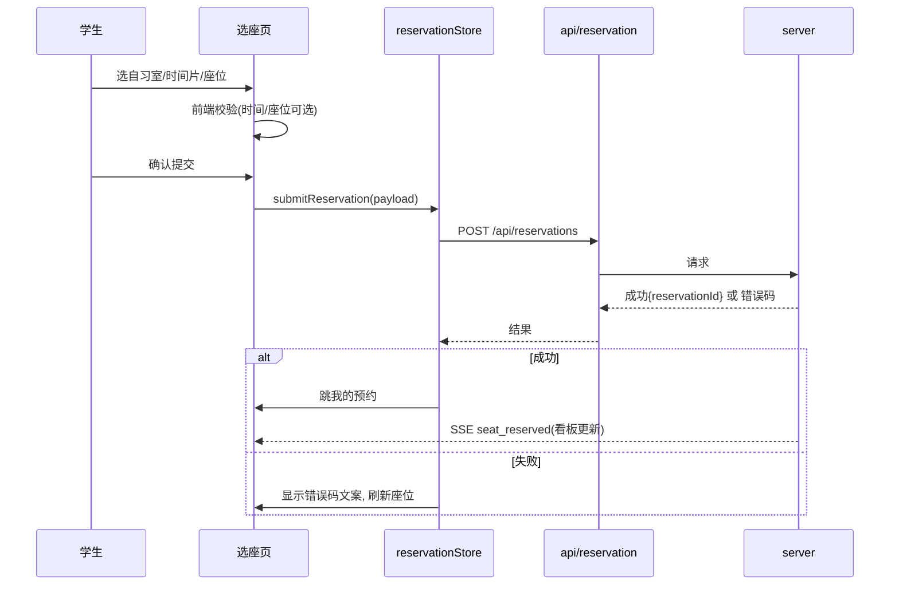

# client/02 · 学生端设计

- **文档目的**：定义学生端交互流程与页面行为。
- **适用范围**：学生端全部页面。
- **读者对象**：前端/Agent。
- **相关文件**：[01-page-route-map](01-page-route-map.md)、[04-seat-grid-and-heatmap](04-seat-grid-and-heatmap.md)、[08-frontend-validation-and-error-handling](08-frontend-validation-and-error-handling.md)。

## 关键结论
- 学生端核心是“筛选→选片→选座→提交”，提交结果一律以后端为准。
- 座位实时性由看板 SSE 驱动，选座页复用同一套 SeatGrid 数据。

## 一、筛选自习室
逐级选择：校区 → 楼栋 → 楼层 → 自习室。选定后展示房间卡片（开放状态、空位概览、进入选座按钮）。空数据给空态提示。

## 二、查看空位
进入选座页拉取 `board_snapshot`：座位网格 + 每格状态（FREE/RESERVED/USING/DISABLED + 本人预约高亮）。仅 FREE 且 cell_type=SEAT 可选。

## 三、选择预约时间
`ReservationTimePicker` 选日期与起止时间，按 30 分钟片对齐；前端校验：
- 不能选过去时间（已过时段禁选/置灰）
- **起 < 止**（开始时间必须早于结束时间，不可等于）
- 若跨天则时间范围非法
- 必须在自习室开放时间范围内
- 单次预约时长不得超过上限（默认 4 小时）
- 时段不可与本人已有预约冲突

> **注意**：时间校验的已知问题已集中迁移至 [docs/08-known-issues.md](../docs/08-known-issues.md) §P3。此章节仅保留前端校验正常规范。

换算成 `slotIndex` 列表用于展示对应时段占用。

## 四、选择座位
在 SeatGrid 点选空闲座位；选中高亮；已占/禁用不可选。选座与所选时间片联动（切换时间片刷新座位可选性）。

## 五、提交预约
`ReservationConfirmDialog` 确认 → `POST /api/reservations`。
- 成功：提示成功，跳“我的预约”，看板收到 `seat_reserved`。
- 失败：按错误码提示（`SEAT_ALREADY_RESERVED` 刷新座位、`DAILY_LIMIT_EXCEEDED`、`USER_IN_BLACKLIST` 等）。

## 六、预约状态展示
“我的预约”按状态分组：待签到/使用中/已完成/已取消/已释放，展示时间、座位、可操作按钮（签到、取消）。

> **已知缺陷**：签到窗口起止时间未在预约详情中展示，且当前时间的签到按钮未校验是否在窗口内（详见 [docs/09-known-issues-v2.md](../docs/09-known-issues-v2.md) §Q1）。

## 七、签到与签退
待签到项在签到窗口内可签到；`POST /api/reservations/{id}/check-in`；超时返回 `SIGN_IN_TIMEOUT` 并提示已释放。
使用中（IN_USE）项可主动签退；`POST /api/reservations/{id}/check-out`，成功后座位释放为 FREE 并（MVP+）+2 积分。若未主动签退，后端在预约结束时间自动完成并释放（见 [../server/06-timeout-release-and-blacklist.md](../server/06-timeout-release-and-blacklist.md) §八）。

## 八、取消预约
`POST /reservations/{id}/cancel`；前端提示“距开始<30 分钟取消将扣分（MVP+）”，最终扣分由后端判定。

## 九、黑名单提示
命中黑名单时预约动作被后端拒绝，跳/提示 `/student/blacklist`，展示解除时间；读页面不受限。

## 十、积分展示【可选】
学生端展示本人 `credit_score` 与近期流水入口，链接排行榜页。

## 十一、附近空位推荐入口【可选】
入口进入 `/student/nearby`，手动选当前位置或浏览器定位，展示推荐列表。

## 学生预约流程时序图

## 实现约束
- 提交中禁用按钮防重复点击，但**不以此作为并发保证**。
- 时间片换算逻辑与后端一致，放 `utils`。

## 验收标准
- 选座→预约→签到闭环可用；各错误码有对应文案；看板实时反映本人预约。

## 给 AI Coding Agent 的提示
选座页与看板页共用 SeatGrid 与状态模型；不要复制两份状态逻辑。
