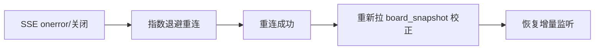

# client/04 · 座位网格与热力图

- **文档目的**：定义座位网格渲染、热力图方案、状态色彩语义与快照 + SSE 实时更新机制。
- **适用范围**：选座页、看板页。
- **读者对象**：前端/Agent。
- **相关文件**：[../server/07-sse-realtime-board.md](../server/07-sse-realtime-board.md)、[06-state-management](06-state-management.md)、[05-component-design](05-component-design.md)。

## 关键结论
- 状态数据 = **一次 board_snapshot 初始化 + 后续 seat_* 增量事件**，前端不推算占用。
- MVP 用**自定义 Grid** 渲染座位更直观；ECharts 热力图用于聚合/密度视图（可选）。

## 一、SeatGrid 组件
按 `rows×cols` 渲染网格，遍历 cells：SEAT 渲染 SeatCell，AISLE/EMPTY 渲染占位。props：`layout`、`seatStatusMap`、`selectable`、`selectedSeatId`；emit：`select(seatId)`。

## 二、SeatCell 组件
单元格：根据 cell_type 与 seatStatus 决定样式与可点击性。仅 `cellType=SEAT && status=FREE && selectable` 可点。

## 三、热力图方案
| 方案 | 用途 | 说明 |
| --- | --- | --- |
| 自定义 Grid（MVP） | 选座 + 看板 | 直接映射物理排布，交互直观 |
| ECharts 热力图（可选） | 密度/时段热度 | 用于报表侧“热门时段/使用密度” |

## 四、座位状态颜色语义
| 状态 | 语义 | 建议色（可主题化） |
| --- | --- | --- |
| FREE | 空闲可选 | 绿色 |
| RESERVED | 已预约待签到 | 橙色 |
| USING | 使用中 | 红色 |
| DISABLED | 不可用 | 灰色 |
| 本人已预约 | 当前用户预约 | 蓝色描边高亮 |

## 五、初始化快照
进入页面：`GET /api/study-rooms/{roomId}/board?date&start&end` → `board_snapshot`（网格 + 每格状态 + 本人预约标记）→ 写入 heatmapStore。

## 六、SSE 增量更新
建立 SSE：`/api/board/stream?roomId&date&start&end`。事件：
| 事件 | 处理 |
| --- | --- |
| `board_snapshot` | 重置整盘状态 |
| `seat_reserved` | 该座位→RESERVED |
| `seat_released` | 该座位→FREE |
| `seat_in_use` | 该座位→USING |
| `seat_disabled` | 该座位→DISABLED |
| `heartbeat` | 仅保活，忽略 |
仅更新受影响座位，避免整盘重渲染。

## 七、断线重连

重连后必须重取快照，避免断线期间漏事件导致状态漂移。

## 八、多客户端实时同步
多端订阅同一 `roomId/date/时段`，任一端引发的状态变更由后端广播，各端局部更新。

## 九、当前用户已预约座位高亮
快照与事件携带 `mine` 标记或前端结合本人预约列表标注；本人预约座位用蓝色描边区分于普通 RESERVED。

## 实现约束
- SSE 事件处理集中在 heatmapStore；组件只读渲染。
- 时段切换 = 重新拉快照 + 重新订阅对应时段。

## 验收标准
- 两端同看板，一端操作另一端秒级更新；断线重连后状态与后端一致。

## 给 AI Coding Agent 的提示
不要用轮询替代 SSE；不要在组件里直接 new EventSource，统一走 `sse/` 封装并分发到 store。
