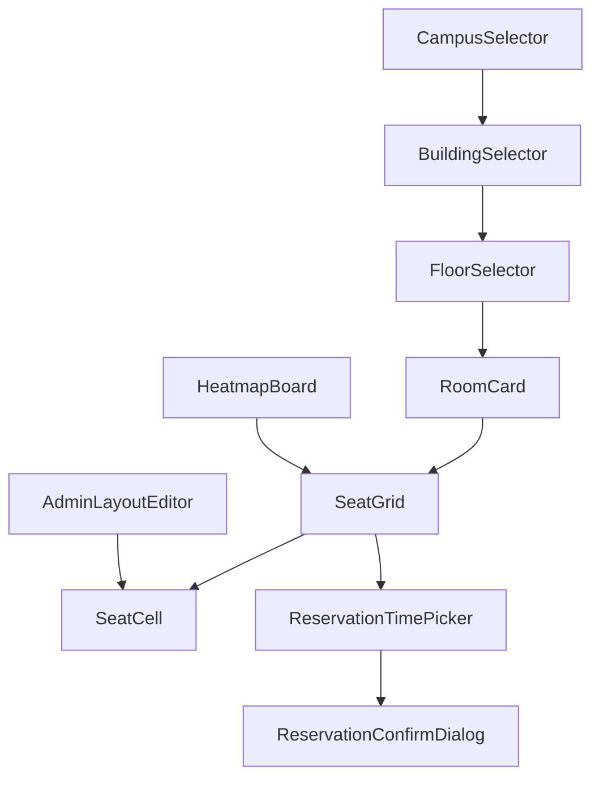

# client/05 · 组件设计

- **文档目的**：定义复用组件的职责、props、emits、依赖接口、内部状态、边界与 MVP 归属。
- **适用范围**：`client/src/components`。
- **读者对象**：前端/Agent。
- **相关文件**：[01-page-route-map](01-page-route-map.md)、[04-seat-grid-and-heatmap](04-seat-grid-and-heatmap.md)、[06-state-management](06-state-management.md)。

## 关键结论
- 组件只做展示与交互，业务数据经 store；跨页共享逻辑不进组件内部状态。

## 组件清单
| 组件 | 职责 | props | emits | 依赖接口 | 内部状态 | 边界 | MVP? |
| --- | --- | --- | --- | --- | --- | --- | --- |
| CampusSelector | 选校区 | `modelValue` | `update:modelValue` | `/api/campuses` | 加载态 | 空列表 | 是 |
| BuildingSelector | 选楼栋 | `campusId,modelValue` | `update:modelValue` | `/api/buildings` | 加载态 | 校区未选 | 是 |
| FloorSelector | 选楼层 | `buildingId,modelValue` | `update:modelValue` | 由 `/api/study-rooms?buildingId=` 结果按 `floorNo` 去重派生（无独立接口） | — | 楼栋未选 | 是 |
| RoomCard | 展示自习室 | `room` | `enter` | — | — | 关闭态房间 | 是 |
| SeatGrid | 座位网格 | `layout,seatStatusMap,selectable,selectedSeatId` | `select` | — | 悬停态 | 空布局 | 是 |
| SeatCell | 单元格 | `cell,status,selectable` | `click` | — | — | 非 SEAT 不可点 | 是 |
| ReservationTimePicker | 选时间片 | `openRange,date,modelValue` | `update:modelValue` | — | 校验态 | 过去时间 | 是 |
| ReservationConfirmDialog | 确认预约 | `visible,summary` | `confirm,cancel` | — | 提交态 | 重复提交 | 是 |
| MyReservationList | 我的预约 | `list` | `checkIn,cancel` | `/api/reservations/me` | 分组态 | 空列表 | 是 |
| AdminLayoutEditor | 排布编辑 | `layout` | `save` | `/api/study-rooms/{id}/layout` | 编辑态 | 保存冲突 | 是 |
| HeatmapBoard | 实时看板 | `roomId,date,range` | — | `/board`+SSE | 连接态 | SSE 断线 | 是 |
| StatsChartCard | 报表图表 | `type,data` | — | `/api/reports/**` | — | 无数据 | 是 |
| ScoreRankingTable | 积分排行 | `period,list` | `changePeriod` | `/api/scores/ranking` | — | 无数据 | 否(MVP+) |
| NearbyAvailableRoomList | 附近空位 | `origin,list` | `refresh` | `/api/rooms/nearest-available` | 定位态 | 无空位/定位失败 | 否(MVP+) |

## 组件依赖关系

## 通用约定
- 受控组件用 `v-model`（`modelValue` + `update:modelValue`）。
- 组件不直接调 Axios；需要数据时由父页面传入或经 store。
- 座位相关组件（SeatGrid/SeatCell）在选座与看板/编辑三种场景复用，通过 `selectable`/`editable` 区分模式。

## 实现约束
- 新增组件登记本表并说明 MVP 归属。
- 【MVP+】组件在 MVP 阶段不实现或仅占位。

## 验收标准
- 组件可独立预览；props/emits 与本表一致。

## 给 AI Coding Agent 的提示
优先复用 SeatGrid/SeatCell，勿为不同页面各写一套座位渲染。
