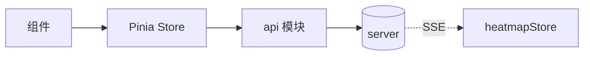

# client/06 · Pinia 状态管理

- **文档目的**：定义各 Store 的 state/getters/actions、持久化与 API 关系。
- **适用范围**：`client/src/stores`。
- **读者对象**：前端/Agent。
- **相关文件**：[07-api-calling-design](07-api-calling-design.md)、[04-seat-grid-and-heatmap](04-seat-grid-and-heatmap.md)、[00-client-overview](00-client-overview.md)。

## 关键结论
- 业务状态集中在 Store；组件不直接调 API。
- 座位实时状态只在 `heatmapStore`，由 SSE 事件驱动。

## Store 清单
| Store | 职责 | MVP? |
| --- | --- | --- |
| userStore | 登录态、token、角色、本人积分 | 是 |
| roomStore | 校区/楼栋/楼层/自习室筛选与列表 | 是 |
| reservationStore | 预约提交、我的预约、签到、取消 | 是 |
| heatmapStore | 看板快照 + SSE 座位状态 | 是 |
| adminStore | 基础数据 CRUD、排布、报表 | 是 |
| scoreStore | 积分与排行榜 | 否(MVP+) |
| nearbyRoomStore | 位置与附近空位推荐 | 否(MVP+) |

## 一、userStore
- **state**：`token, role, userInfo, creditScore`。
- **getters**：`isLogin, isAdmin, isStudent`。
- **actions**：`login(), logout(), fetchProfile()`。
- **持久化**：`token/role` 持久化（localStorage）；其余内存。
- **API**：`/api/auth/login`,`/api/users/me`。

## 二、roomStore
- **state**：`campuses, buildings, rooms, filter{campusId,buildingId,floorNo}`。
- **getters**：`filteredRooms`。
- **actions**：`loadCampuses(), loadBuildings(), loadRooms()`。
- **持久化**：`filter` 可 session 持久化。
- **API**：`/api/campuses`,`/api/buildings`,`/api/study-rooms`。

## 三、reservationStore
- **state**：`myReservations, submitting`。
- **getters**：`byStatus`。
- **actions**：`submitReservation(), loadMyReservations(), checkIn(), checkOut(), cancel()`。
- **持久化**：无（每次刷新）。
- **API**：`/api/reservations`,`/api/reservations/me`,`/{id}/check-in`,`/{id}/check-out`,`/{id}/cancel`。

## 四、heatmapStore
- **state**：`roomId, date, range, seatStatusMap, sseState`。
- **getters**：`statusOf(seatId)`。
- **actions**：`loadSnapshot(), connectSse(), onSseEvent(), disconnect(), reconnect()`。
- **持久化**：无（实时数据）。
- **API**：`/board` + SSE `/api/board/stream`。

## 五、adminStore
- **state**：`campuses, buildings, rooms, currentLayout, reports`。
- **actions**：`crud 各实体, loadLayout(), saveLayout(), loadReport()`。
- **API**：基础数据 CRUD、`/layout`、`/api/reports/**`。

## 六、scoreStore【MVP+】
- **state**：`myScore, records, ranking, period`。
- **actions**：`loadMyScore(), loadRanking(period)`。
- **API**：`/api/scores/me`,`/api/scores/ranking`。

## 七、nearbyRoomStore【MVP+】
- **state**：`origin, list, locating`。
- **actions**：`setOrigin(), locate(), loadNearest()`。
- **API**：`/api/rooms/nearest-available`,`/api/rooms/availability-summary`。

## Store 与 API 关系

## 实现约束
- token 只存 userStore 并注入 API 层，勿散落组件。
- SSE 事件只更新受影响座位，避免整盘替换。

## 验收标准
- 组件无直接 Axios 调用；SSE 状态集中在 heatmapStore。

## 给 AI Coding Agent 的提示
新增 store 登记本表并说明 MVP 归属；跨页共享状态一律进 store，不用 props 透传多层。
