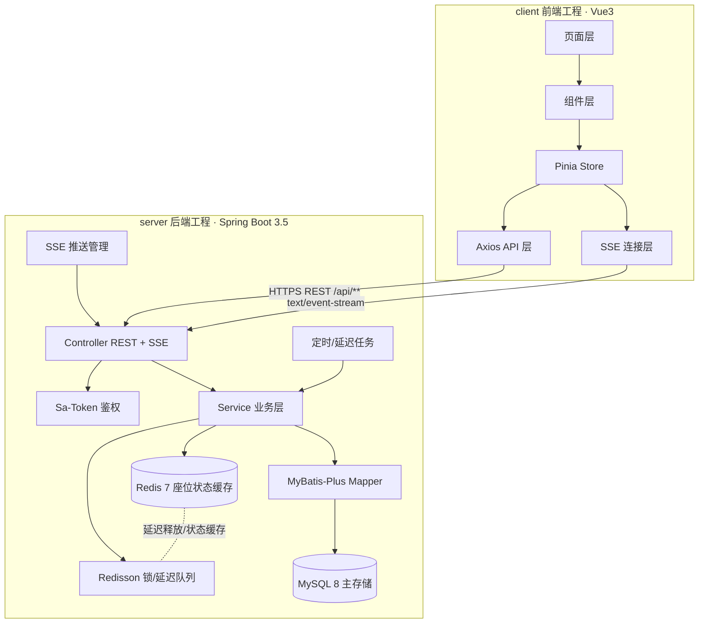
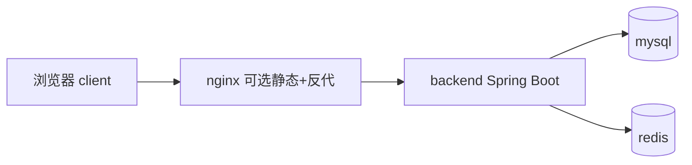

# docs/02 · 系统总体架构

- **文档目的**：定义 SeatWise Campus 的 C/S 总体架构、组件边界与关键技术决策。
- **适用范围**：全项目架构基线，是一致性约束的权威来源。
- **读者对象**：架构/前后端/Agent。
- **相关文件**：[server/00-server-overview.md](../server/00-server-overview.md)、[client/00-client-overview.md](../client/00-client-overview.md)、[server/05](../server/05-reservation-concurrency-control.md)、[server/07](../server/07-sse-realtime-board.md)。

## 关键结论
- 前端 **只** 通过 REST + SSE 访问后端；**不接触数据库**。
- 后端是**唯一权威**：业务规则、并发、权限、一致性都在 server。
- **MySQL 是正确性来源**，Redis 是加速与调度层，二者职责不可混淆。

## 一、总体架构图


## 二、client / server 边界
| 维度 | client | server |
| --- | --- | --- |
| 职责 | 展示、交互、表单校验、调用 API/SSE | 业务规则、权限、并发、一致性、推送 |
| 数据 | 只持有视图状态 | 持久化与缓存 |
| 正确性 | 不判定最终结果 | 唯一裁决者 |

## 三、通信方式
| 通道 | 协议 | 用途 |
| --- | --- | --- |
| REST API | HTTP/JSON | 登录、CRUD、预约、签到、报表等请求-响应 |
| SSE | text/event-stream | 服务端 → 客户端 座位状态增量推送 |

统一响应结构（约定）：
```json
{ "code": 0, "message": "ok", "data": {}, "traceId": "..." }
```
`code=0` 成功；非 0 为业务错误码（见 [GLOSSARY.md](../GLOSSARY.md)）。

## 四、存储与中间件职责
| 组件 | 职责 | 不负责 |
| --- | --- | --- |
| MySQL 8 | 主存储、唯一索引兜底、事务一致性 | 高频计数缓存 |
| Redis 7 | 座位状态缓存、单日计数、SSE 辅助 | 最终正确性 |
| Redisson | 分布式锁、DelayedQueue 延迟释放 | 替代唯一索引 |
| Sa-Token | 登录态、角色鉴权 | 业务规则 |
| Knife4j | 接口文档 | 运行时逻辑 |
| Docker Compose | 本地/演示一键部署 | 生产编排 |

## 五、为什么不让前端判断座位占用
1. 前端状态可能过期（并发下他人已占）。
2. 前端可被绕过/篡改，无法保证正确性。
3. 多客户端无法互斥。
→ 结论：**前端只做体验校验，占用判定与写入必须在后端并以唯一索引兜底。**

## 六、为什么并发控制必须在服务端
- 需要**跨请求、跨客户端**的互斥，只有服务端 + 共享存储能做到。
- Redisson 锁降低冲突概率，但锁失效/超时仍可能并发写库，**必须由 MySQL 唯一索引最终兜底**。
- Redis 可用性不等于正确性；断电/延迟下 Redis 不可信，MySQL 事务与约束才可信。
详见 [server/05](../server/05-reservation-concurrency-control.md)。

## 七、部署拓扑（本地/演示）

详见 [server/11-deployment-docker-compose.md](../server/11-deployment-docker-compose.md)。

## 实现约束
- 禁止前端直连数据库或缓存。
- 预约写路径必须经过 Service 层的锁 + 事务 + 唯一索引。
- SSE 只做服务端→客户端单向推送；需要双向再评估 WebSocket。

## 验收标准
- 抓包确认前端只访问 `/api/**` 与 SSE 端点。
- 断开 Redis 后并发预约仍不双占（唯一索引生效）。

## 给 AI Coding Agent 的提示
本文件是一致性约束权威。任何与之冲突的实现都应先修正实现或先在此更新架构决策，不得私自偏离。
