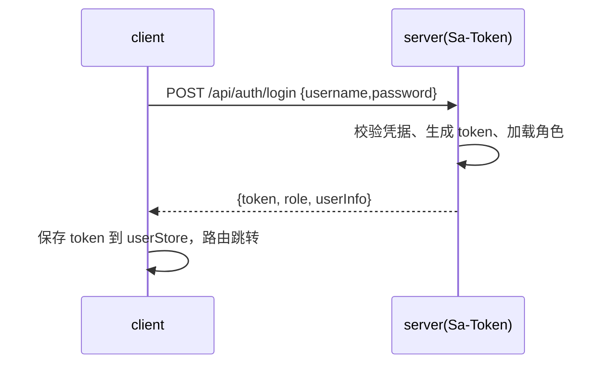
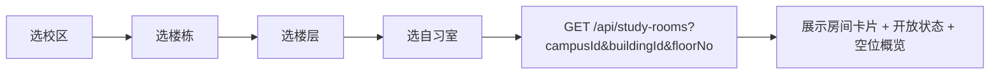
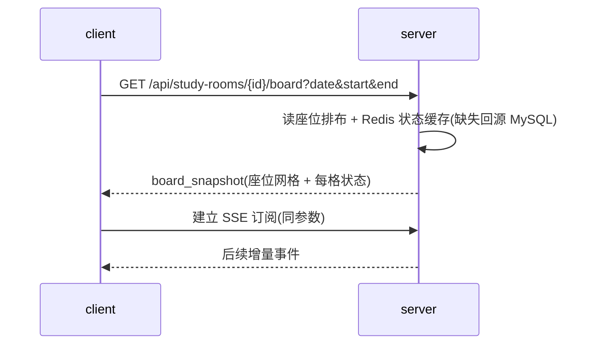
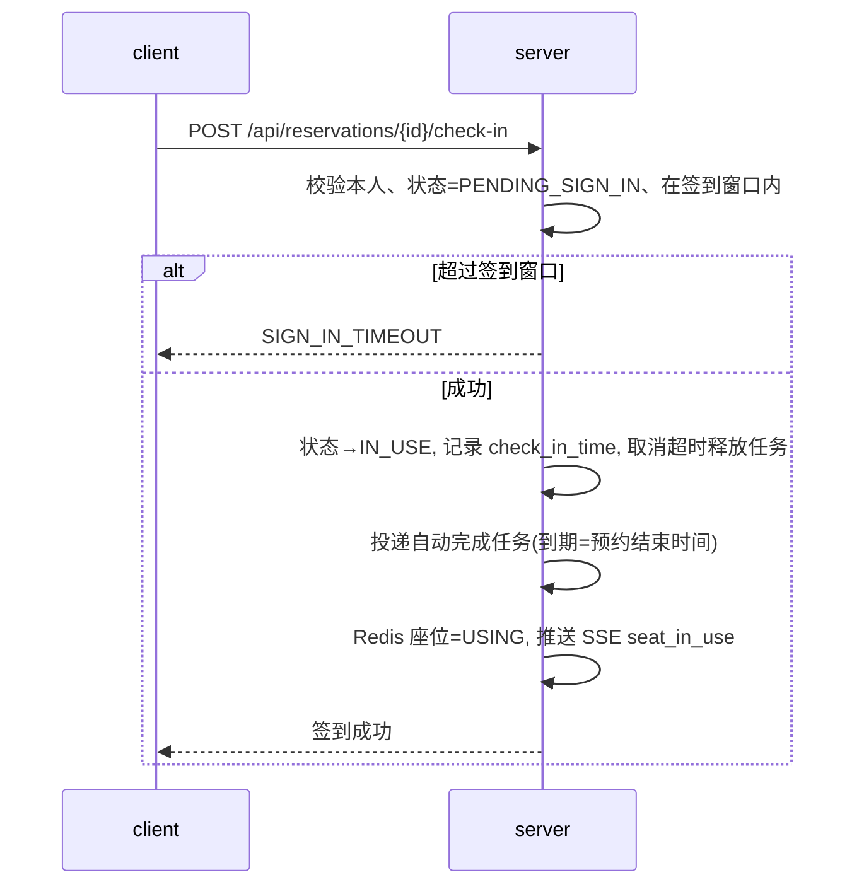
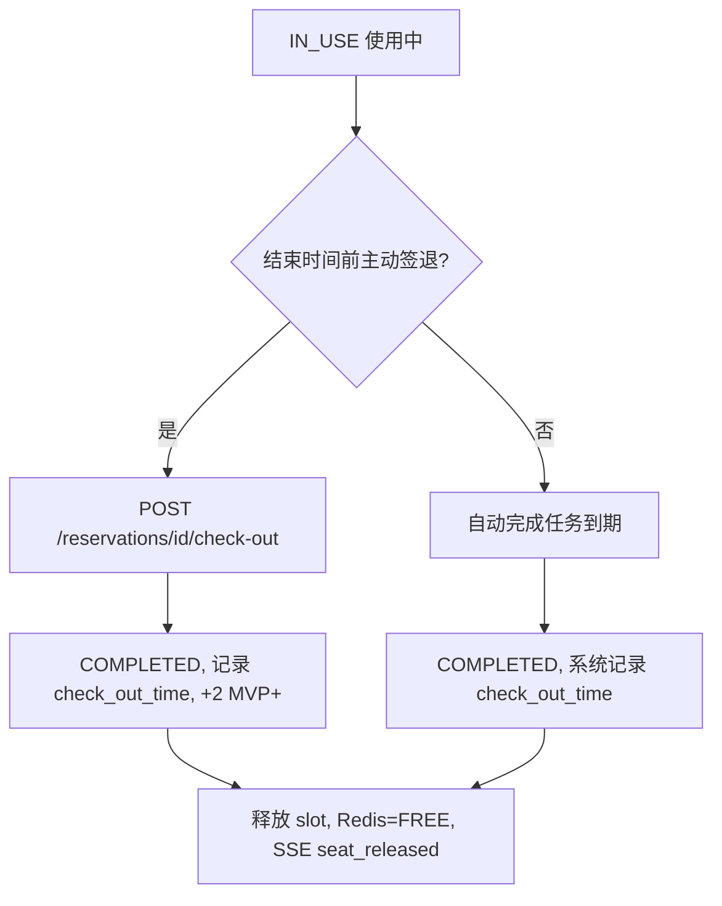
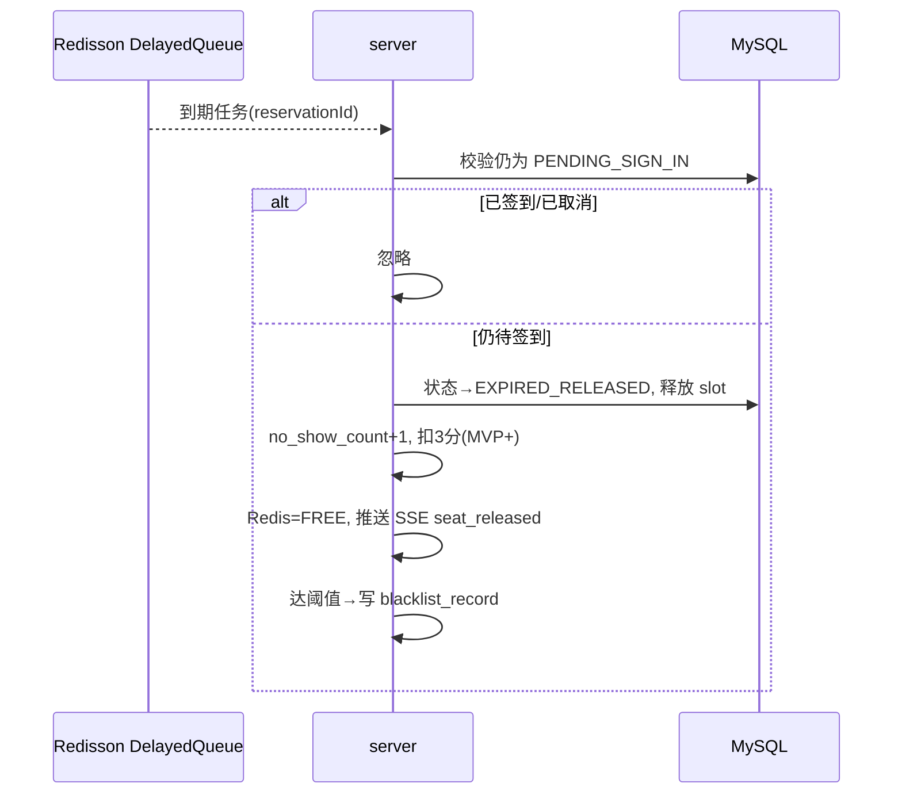
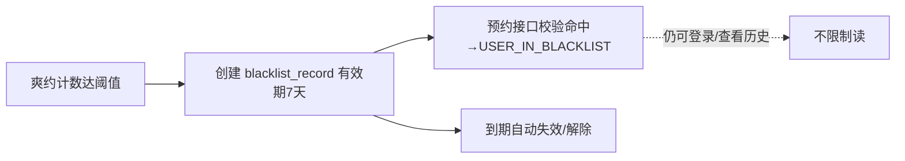
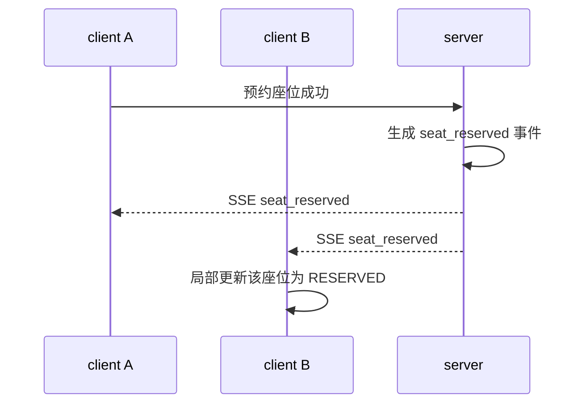
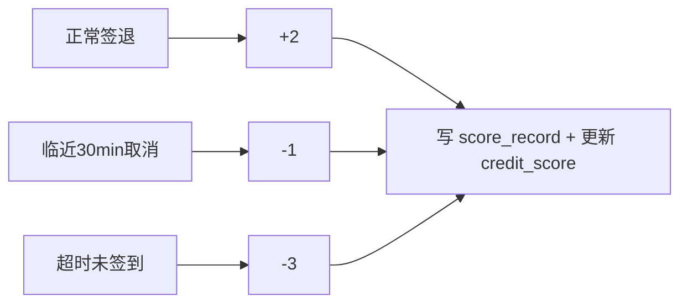
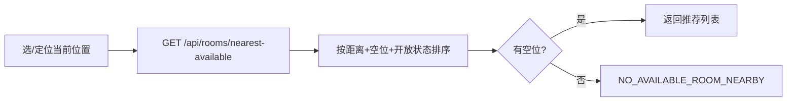

# docs/03 · 核心业务流程

- **文档目的**：用流程图/时序图刻画关键业务路径，作为前后端实现的共同参照。
- **适用范围**：预约主线全流程。
- **读者对象**：前后端/测试/Agent。
- **相关文件**：[server/05](../server/05-reservation-concurrency-control.md)、[server/06](../server/06-timeout-release-and-blacklist.md)、[server/07](../server/07-sse-realtime-board.md)、[client/02](../client/02-student-side-design.md)。

## 关键结论
- 所有“写”类流程都以后端事务为准；前端只驱动与展示。
- 预约成功后一切状态流转（签到/超时/取消）都会触发 SSE 与（可选）积分变化。

## 一、学生登录


## 二、筛选自习室


## 三、查询座位状态


## 四、提交预约（并发控制，核心）
```mermaid
sequenceDiagram
    participant C as client
    participant S as server
    participant R as Redisson
    participant DB as MySQL
    C->>S: POST /api/reservations {roomId,seatId,date,startTime,endTime}
    S->>S: 校验登录/角色/黑名单/时间/单日次数/自身时段冲突
    S->>S: 起止时间→slotIndex 列表
    S->>R: lock seat:{seatId}:date:{date}:slots:{range}
    S->>DB: BEGIN; insert reservation; batch insert reservation_slot
    alt 唯一索引冲突
        DB-->>S: DuplicateKey
        S->>S: 回滚
        S-->>C: SEAT_ALREADY_RESERVED
    else 成功
        S->>DB: COMMIT
        S->>S: 写 Redis 座位状态=RESERVED
        S->>S: 注册超时释放延迟任务
        S->>S: 推送 SSE seat_reserved
        S->>R: unlock
        S-->>C: 预约成功(reservationId)
    end
```
详细步骤见 [server/05](../server/05-reservation-concurrency-control.md)。

## 五、签到


## 五之二、签退 / 自动完成

详见 [server/06 §八](../server/06-timeout-release-and-blacklist.md)。

## 六、取消预约
```mermaid
flowchart TB
    A[POST /api/reservations/id/cancel] --> B{状态可取消?}
    B -- 否 --> E[RESERVATION_NOT_FOUND / 非法状态]
    B -- 是 --> C{距开始>30分钟?}
    C -- 是 --> D[CANCELLED 不扣分]
    C -- 否 --> F[CANCELLED 扣1分(MVP+)]
    D --> G[释放 slot, Redis=FREE, SSE seat_released]
    F --> G
```

## 七、超时释放


## 八、黑名单


## 九、管理员维护座位
```mermaid
flowchart LR
    A[进入排布编辑器] --> B[编辑行列网格/cell_type/seat_no]
    B --> C[PUT /api/study-rooms/id/layout {layoutJson}]
    C --> D[后端校验并落库 seat 表]
    D --> E[看板/查询读取新排布]
```

## 十、实时看板更新


## 十一、积分变化（MVP+）


## 十二、最近空位推荐（MVP+）


## 实现约束
- 图中所有“状态变更”均在后端事务内完成并触发 SSE。
- 超时释放以延迟任务为主、全表扫描为兜底。

## 验收标准
- 每个流程可在 [docs/07](07-acceptance-checklist.md) 找到对应验收项。

## 给 AI Coding Agent 的提示
实现某流程前对照本图与对应 server/client 文档；不要新增图外的隐式状态转移。
