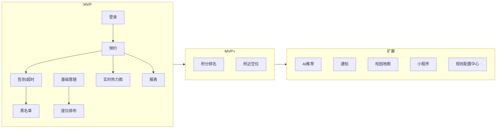

# docs/04 · MVP 范围

- **文档目的**：明确划分 MVP / MVP+ / 后续扩展，防止 Agent 一次性实现过大范围。
- **适用范围**：全项目范围管理。
- **读者对象**：开发/测试/Agent/答辩。
- **相关文件**：[ROADMAP.md](../ROADMAP.md)、[docs/05-extension-design.md](05-extension-design.md)、[docs/07-acceptance-checklist.md](07-acceptance-checklist.md)。

## 关键结论
- **MVP = P0–P6**，是答辩可完整演示的最小闭环。
- **MVP+ = 积分排名 + 最近空位推荐（P7–P8）**，锦上添花但已预留完整设计。
- **扩展 = AI 推荐 / 通知 / 校园地图 / 小程序 / 规则配置中心（P9+）**，只保接口与文档。

## 一、MVP 必须包含
| 功能 | 说明 | 对应阶段 |
| --- | --- | --- |
| 登录 | Sa-Token，STUDENT/ADMIN | P1 |
| 学生预约 | 筛选→选片→选座→提交 | P3 |
| 自习室基础管理 | 校区/楼栋/楼层/自习室/开放时间 | P1 |
| 座位排布 | 行列网格 + cell_type | P2 |
| 并发防重复预约 | Redisson 锁 + 唯一索引兜底 | P3 |
| 签到 | 窗口内签到，超时释放 | P4 |
| 超时释放 | 延迟任务自动释放 | P4 |
| 黑名单 | 爽约阈值 → 限制预约 | P4 |
| 实时热力图 | 快照 + SSE | P5 |
| 基础报表 | 使用率/时段/取消率/爽约率/排行 | P6 |

## 二、MVP+ 可以包含
| 功能 | 说明 | 对应阶段 | 可砍 |
| --- | --- | --- | --- |
| 积分排名 | 守约加分/爽约扣分/排行榜 | P7 | 规则配置化可砍 |
| 最近空位推荐 | 距离+空位+开放状态 | P8 | 浏览器定位可砍 |

## 三、后续扩展
| 功能 | 状态 |
| --- | --- |
| AI 推荐（错峰/座位/自习室） | 仅接口与文档 |
| 通知提醒（开始前/超时前/解禁） | 预留 notification 表与通知中心 |
| 校园地图组件 | 预留坐标字段与扩展点 |
| 移动端 / 微信小程序 | 后续 |
| 管理端预约规则配置中心 | 后续（先硬编码规则） |

## 四、范围边界图

## 五、MVP 完成判定（Definition of Done）
- 学生可完成“登录→筛选→选座→预约→签到→（或超时释放）”闭环。
- 并发 10 请求同座同片仅 1 成功。
- 两客户端看板实时同步。
- 管理员可维护基础数据并查看基础报表。
- Docker Compose 一键起依赖。

## 实现约束
- 每条功能带阶段标签，Agent 不得越阶段实现。
- MVP+ 的表/字段可提前预留（不影响 MVP），但业务逻辑延后到 P7/P8。

## 验收标准
对照 [docs/07](07-acceptance-checklist.md) 的“MVP 功能验收”“并发验收”“实时验收”全部通过。

## 给 AI Coding Agent 的提示
默认只实现当前 ROADMAP 阶段；要跨进 MVP+/扩展时先与用户确认。数据库可提前预留扩展字段，但不要提前写扩展业务逻辑。
