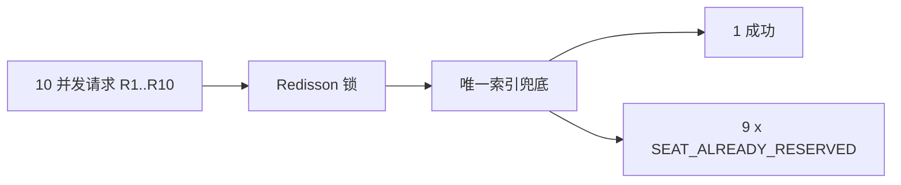

# docs/06 · 答辩演示脚本

- **文档目的**：给出可复现的答辩演示流程，突出并发、实时、公平三大亮点。
- **适用范围**：演示/答辩环节。
- **读者对象**：演示者/测试/Agent（生成种子数据脚本）。
- **相关文件**：[docs/03](03-core-business-flows.md)、[docs/07](07-acceptance-checklist.md)、[server/11](../server/11-deployment-docker-compose.md)。

## 关键结论
- 演示主线：**并发抢座**与**多端实时同步**是最有说服力的两个场景。
- 演示前务必用固定种子数据，保证可复现。

## 一、演示准备
| 项 | 内容 |
| --- | --- |
| 环境 | `docker compose up -d`（mysql/redis/backend），前端 `npm run dev` |
| 账号 | admin/admin、student1、student2、student3（种子数据） |
| 浏览器 | 至少 2 个窗口（或 2 台设备）用于实时看板对比 |
| 接口文档 | Knife4j `/doc.html` 备用 |

## 二、初始化数据
1. 执行初始化 SQL（校区/楼栋/自习室/座位排布/账号）。
2. 校区：中心校区；楼栋：图书馆 A 座；楼层：3F；自习室：A301（6×8 网格，含过道）。
3. 账号：管理员 1 个、学生 3 个；student3 预置接近黑名单阈值（便于演示）。

## 三、管理员录入座位
1. 管理员登录 → 校区/楼栋/自习室管理，展示已录入数据。
2. 打开 A301 排布编辑器：展示行列网格、SEAT/AISLE/EMPTY/DISABLED、座位编号生成、保存布局 JSON。
3. 禁用一个座位，展示其变为 DISABLED 不可预约。

## 四、学生预约座位
1. student1 登录 → 按校区/楼栋/楼层筛选到 A301。
2. 选日期 + 时间片（如 14:00–16:00）。
3. 网格中选空闲座位 A-05 → 提交 → 预约成功，座位变 RESERVED（本人高亮）。
4. 展示“我的预约”记录。

## 五、两个客户端实时看板同步
1. 窗口 A（管理员看板）与窗口 B（student2）同时打开 A301 看板。
2. student1 预约 A-05 → A、B 两窗口该座位**秒级**变为 RESERVED。
3. 说明机制：初始化快照 + SSE 增量事件（`seat_reserved`）。

## 六、并发抢座演示
1. 用脚本或多人同时对**同一座位同一时间片**发起 10 个预约请求。
2. 结果：仅 1 个成功，其余返回 `SEAT_ALREADY_RESERVED`。
3. 说明：Redisson 锁降低冲突 + MySQL `reservation_slot` 唯一索引最终兜底。

## 七、超时释放演示
1. student2 预约近端时间片但不签到（或将签到窗口调短演示）。
2. 超过签到窗口 → 座位自动从 RESERVED 变回 FREE，看板同步 `seat_released`。
3. 说明：Redisson DelayedQueue 到期任务触发释放，`no_show_count+1`。

## 八、黑名单演示
1. 让 student3 再爽约一次达到阈值 → 生成 `blacklist_record`。
2. student3 尝试预约 → 返回 `USER_IN_BLACKLIST`。
3. 展示 student3 仍可登录、查看历史记录（读不受限）。

## 九、报表演示
1. 管理员报表页展示：日均使用率、热门时段、取消率、爽约率、利用率排行。
2. 说明数据来自 `room_daily_stats` 聚合表（定时任务生成），非实时全表扫描。

## 十、积分排名演示（可选，MVP+）
1. 展示 student1 正常签退 +2、student3 超时 -3。
2. 打开排行榜页展示周榜排序。

## 十一、最近空位推荐演示（可选，MVP+）
1. student2 手动选择“当前在图书馆 A 座”。
2. 点“附近有空位” → 返回按距离+空位排序的自习室列表，不含无空位房间。
3. 定位失败时演示回退为手动选择。

## 实现约束
- 演示用签到窗口/黑名单阈值可通过配置调短，演示后复原。
- 种子数据脚本与初始化 SQL 纳入仓库，保证可复现。

## 验收标准
- 上述 6、7、8 三个核心场景现场可稳定复现。

## 给 AI Coding Agent 的提示
如需生成种子数据/演示脚本，放入 `server` 初始化 SQL 与脚本目录，不要污染业务代码；数值参数走配置常量。
