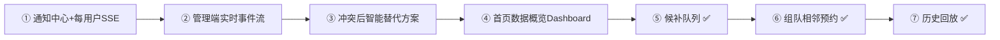

# docs/12 · 增强规划（让演示更惊艳、功能更完善）

- **文档目的**：在 MVP/MVP+ 与已落地增强（AI 助手、临时锁座）之上，规划下一批「提升演示效果 + 完善度」的功能，按性价比排序，指导后续实现。
- **适用范围**：全项目。
- **读者对象**：开发/答辩/Agent。
- **相关文件**：[docs/10-校园座位预约系统-改进建议.md](10-校园座位预约系统-改进建议.md)、[server/14-ai-assistant-design.md](../server/14-ai-assistant-design.md)、[server/15-temporary-seat-hold.md](../server/15-temporary-seat-hold.md)。

## 关键结论
- 已落地大型增强：**AI 智能选座助手**（server/14）、**临时锁座与倒计时**（server/15）。
- 下一批优先做**复用现有 SSE、工作量适中、答辩加分**的完善项；大型系统性功能（候补队列、组队、历史回放）排后。

## 优先级总览

## ① 站内通知中心 + 每用户 SSE（✅ 已实现 2026-07-09）
- **价值**：把「积分 +2/-3、进入黑名单、临时锁到期」等事件实时推送并留存，系统从"预约工具"升级为"有反馈的平台"。文档 docs/10 §十一 明确要求「通知写清原因」。
- **数据库**：新增 `notification(user_id,type,title,content,read_flag,created_time)`。
- **实时**：新增**每用户 SSE 通道** `/api/notifications/stream?token=`，事件产生即推送；前端顶部铃铛红点 + 站内抽屉列表 + toast。
- **触发点**：签退(+2)/临近取消(-1)/超时未签到(-3)/进入黑名单，均写明原因。
- **接口**：`GET /api/notifications`、`GET /api/notifications/unread-count`、`POST /api/notifications/{id}/read`、`POST /api/notifications/read-all`、`GET /api/notifications/stream`。

## ② 管理端实时事件流（✅ 已实现 2026-07-09）
- 右侧滚动事件列表：`15:42 A-05 完成签到 / 临时锁定 / 超时释放`，点击定位座位。复用现有 SSE `seat_*` 事件聚合成全局事件流。

## ③ 冲突后智能替代方案（✅ 已实现 2026-07-09）
- 预约提交遇 `SEAT_ALREADY_RESERVED` 时，复用 AI 推荐引擎即时给出「相邻/同房间/同楼层」替代座位，一键切换重提，提升"智能感"。

## ④ 首页数据概览 Dashboard（✅ 学生端+管理端已实现 2026-07-09）
- 学生端/管理端登录后概览卡片（今日预约、空位率、积分、排名），ECharts 迷你图，观感更完整。

## ⑤ 候补队列（✅ 已实现 2026-07-09）
- 无空位时一键加入候补（选座页「全部占满，加入候补队列」）；座位释放（取消 / 超时 / 签退 / 自动完成）时按 FIFO 匹配队首、复用 `hold:` Redis TTL 保留 60 秒给该候补者，`seat_hold` SSE 广播 + 站内通知（type=`WAITLIST`）。
- 候补者在「我的候补」页倒计时内「立即确认预约」→ 复用 `ReservationService.create`（唯一索引兜底）落库为正式预约；超时未确认由 `ScheduledJobs` 的 `expireOffers()` 释放并顺延下一位。
- 串联超时释放 / 取消 / 推送 / 临时锁，形成完整业务闭环。
- 落地：表 `waitlist`；`Waitlist`/`WaitlistMapper`/`WaitlistService`/`WaitlistController`；`ReservationService` 四个释放点回调 `onSeatReleased`；前端 `waitlistApi` + `views/student/Waitlist.vue` + 菜单/路由。测试 `scripts/test-waitlist.mjs` 11/11。

## ⑥ 组队相邻预约（✅ 已实现 2026-07-09）
- 一次为多名成员预约**同一自习室、同一时段的相邻座位**（同排连续列），全部成功或整体回滚，展示分布式并发原子性。
- 并发：所有座位按 seatId **升序取 Redisson 锁**避免交叉死锁；**单事务**批量插入 `reservation`+`reservation_slot`，任一 `uk_seat_date_slot` 冲突→整单回滚；成功后逐座清理临时锁、SSE `seat_reserved`、通知每位成员（type=`GROUP`）。
- 每座仍是独立 `reservation`，签到/超时/候补/看板完全复用；按成员拆分归属避免单人同时段自冲突。
- 接口 `POST /api/reservations/group`；`groupMaxSeats` 默认 6。设计见 [server/16-group-reservation.md](../server/16-group-reservation.md)。
- 落地：`GroupReservationDTO`；`ReservationService.createGroup/ensureAdjacent`；前端 Seats 页「组队相邻预约」开关+成员分配+网格多选高亮。
- 测试 `scripts/test-group.mjs` 7/7：含**并发两组抢重叠相邻座位，恰好一组整体成功、败组原子回滚**。

## ⑦ 历史回放（✅ 已实现 2026-07-09）
- 管理端拖动播放条/自动播放，重建当天座位占用轨迹；利用率仪表盘 + 全天占用曲线（sparkline）一眼定位「最拥挤时刻」。
- **无需事件表**：直接以 `reservation`（待签到/使用中/已完成）为真源，`BoardService.buildReplay` 按时间片重建每帧占用集合；回放范围取自习室开放时段。
- 接口 `GET /api/study-rooms/{id}/replay?date=`；`ReplayVO{seats, timeline[{slotIndex,label,occupied[],occupiedCount}]}`。
- 前端 `views/admin/Replay.vue`（复用 SeatGrid + el-slider + el-segmented 倍速 + 仪表盘 + 曲线），入口在实时看板页「历史回放」按钮。
- 测试 `scripts/test-replay.mjs` 7/7；演示数据 `scripts/seed-replay.mjs` 生成起伏曲线。

## 实现约束
- 每用户 SSE 与看板 SSE 分离；通知只做站内，不接真实短信/推送通道。
- 通知内容必须写明原因（例："积分 -3 · 预约开始后 15 分钟内未签到"）。
- 复用既有确定性引擎/事件，不新增正确性风险。

## 验收标准
- ① 完成：事件产生 → 学生端铃铛红点 +1 + toast + 抽屉可见，标记已读生效，刷新后留存。

## 给 AI Coding Agent 的提示
按序推进；每落地一项更新本文件状态与对应设计文档。通知触发点集中在预约状态机与黑名单处，勿散落。
