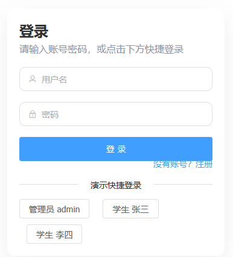
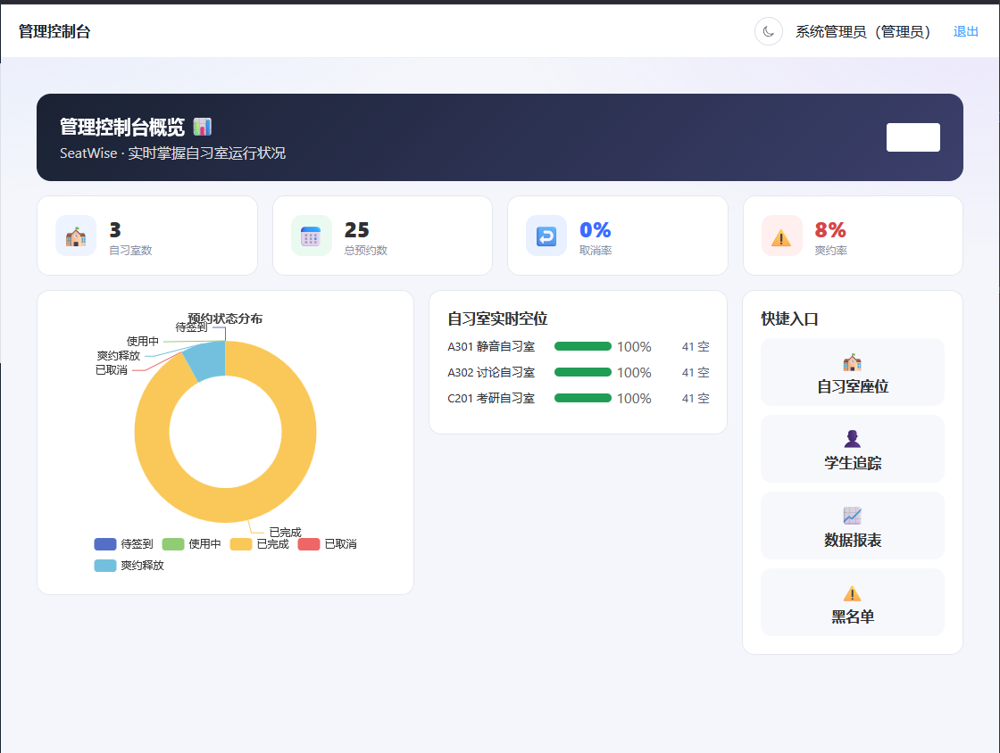
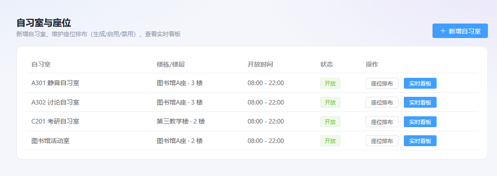
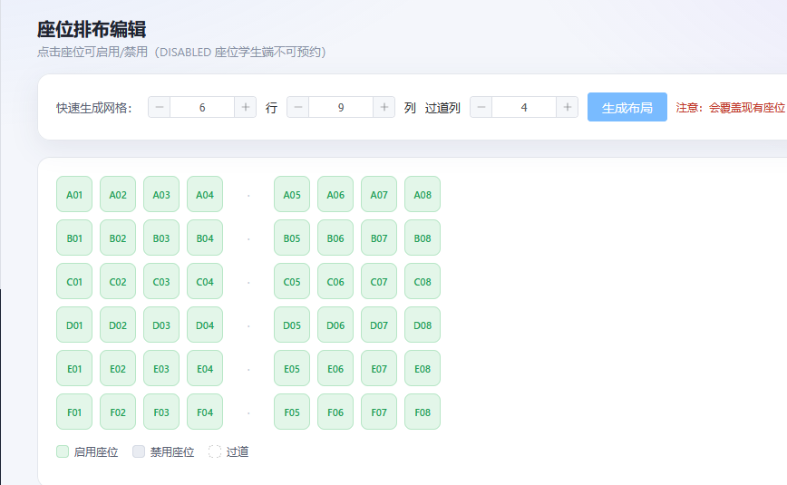
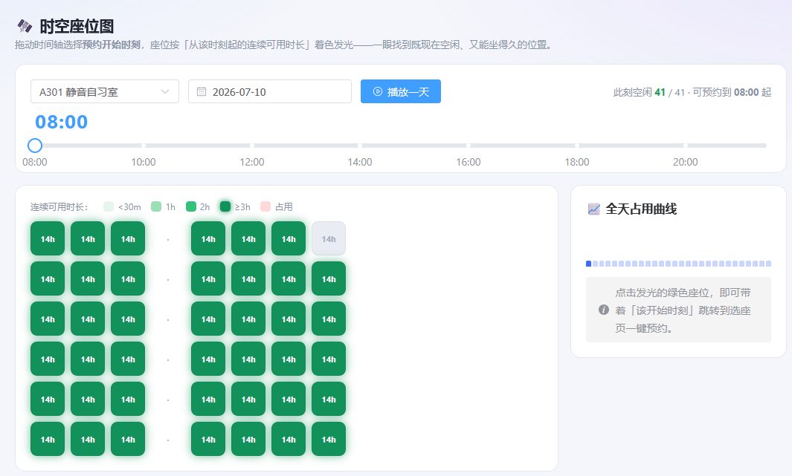

一点可以优化的空间

1. 前端注册搞成右下角角标，不然挤在那边有点难看如果可以结合一个图形验证码功能（）

2. 管理员-概览首页界面，这个刷新按键完全看不到

3. 管理员-自习室与座位-缺少删除自习室功能，新增自习室中，可选的所属楼栋固定（只能选两种，通常应该是可以在不同地方的，考虑是否往数据库里新添加一个地点的报表？并且添加一个增加楼栋的功能？）

4. 自习室似乎不能主动在指定时间内关闭，或者说完全没有暂时关闭的功能

5. 自习室的座位排布只能添加一个过道，我觉得应该是管理员自主设置哪些位置是过道或者没有座位的地方（比如教室后排每一列椅子数量不同），哪些位置是座位比较合理

6.  管理员考虑加入功能可以自主添加子管理员账号

7. 管理员应该更需要时空座位图，学生端时空座位图最好和选座预约结合，考虑在时间轴的slider上自主选择预约时间？

8. 学生端最好直接做一个预约限制和须知，比如说只能告知其预约当天的座位，并且预约前30分钟放弃预约会被扣分等等

9. 通知功能似乎不是很完善，不论是公告还是提醒都显示是announcement?

10. 管理员可以修改存在未来预约的自习室的座位，务必在修改座位前提醒管理员这个情况，或者直接禁止修改，管理员最好只允许在关闭自习室的情况下修改座位（关闭自习室这个功能似乎完全没添加），并且关闭自习室可以联动公告功能，提示所有预约这个自习室的学生相关事宜。

11. 附近空位功能尚未完善，最好是结合定位情况？这样的话，管理员应该可以管理地点的位置（最好是经纬度或者地图选点，并且限制合法的地点位置，仅在校园内），同时学生也应该提供定位功能。

12. 下一步可以考虑加入AI选座，苹果钟功能（后者我强烈推荐）。