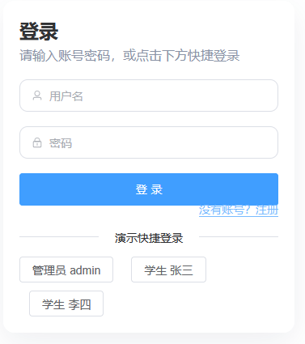
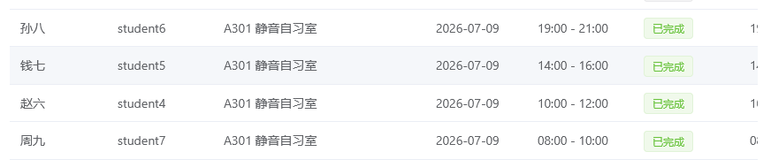
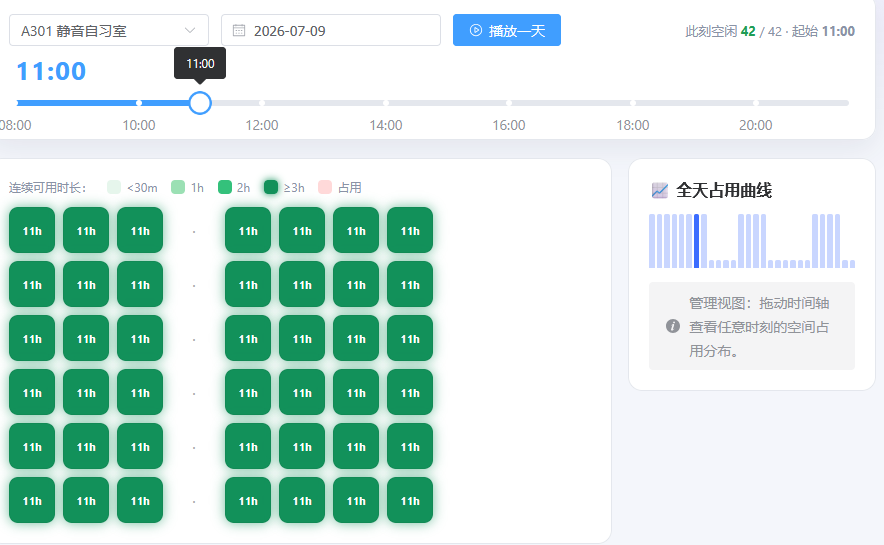
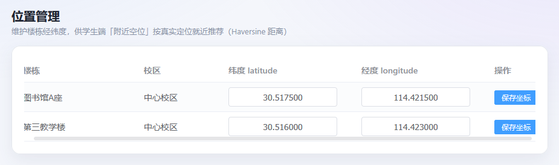
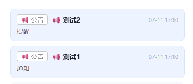
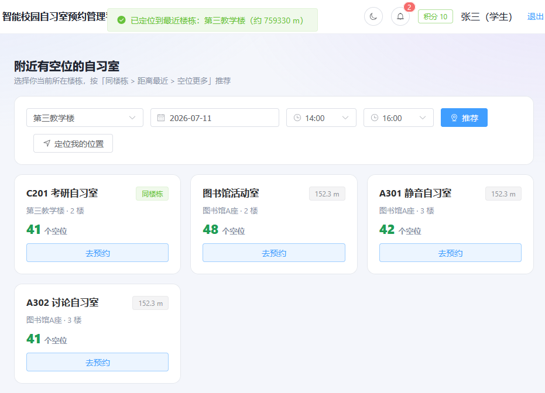

# 已解决

1. 注册登录的这个前端还是很丑，最好改下，考虑加入忘记密码功能

2. 管理员时空占座图应该是有和学生预约追踪联动的，但是一个问题，为什么学生预约追踪里的已有记录全部都没有座位？如果是AI制造的数据可能在展示前需要优化一下

3. 管理员的位置管理想要新加位置需要在自习室与座位里添加，并且后续还需要在位置管理里调整经纬度，有点麻烦。经纬度是否可以加入地图选点？

4. 学生端提醒和测试前端上的 站内通知 中还是长一样

5. 学生端附近空位的前端部分，似乎不能正常显示距离

6. 管理员端最好也能看到积分排名
