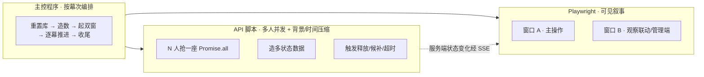

# pre/00 · 功能演示总览与三问结论

- **文档目的**：为 SeatWise Campus 的一次**功能展示/答辩录制**给出可执行的整体方案，回答「演示什么 / 脚本怎么来 / Playwright 能否全包」三个问题。
- **适用范围**：演示/录制环节（暂不涉及 mobile 端）。
- **读者对象**：演示者、录制者、执行编排的 Agent。
- **相关文件**：[01-feature-catalog.md](01-feature-catalog.md)、[02-api-simulation.md](02-api-simulation.md)、[03-playwright-plan.md](03-playwright-plan.md)、[04-orchestration.md](04-orchestration.md)；事实来源 [../README.md](../README.md)、[../RUN.md](../RUN.md)、[../docs/06-demo-script.md](../docs/06-demo-script.md)、[../client/src/router/index.js](../client/src/router/index.js)、[../client/src/api/index.js](../client/src/api/index.js)。

---

## 关键结论

- **双层演示**：上层 **Playwright** 驱动可见的**关键用户操作**（选座、签到、锁座、候补确认…），并让两个有头浏览器**互相印证**（一端操作、另一端实时观察）；下层 **API 脚本**负责**多用户并发调用 + 背景流量/时间压缩**（N 人抢一座、造多状态数据、触发释放/候补…）。二者由**主控程序**按幕次编排。
- 最有说服力的两个场景是 **并发抢座正确性** 与 **多端实时看板一致性**——一切编排都围绕它们展开（与 [../docs/06-demo-script.md](../docs/06-demo-script.md) 一致）。
- 演示环境固定为 **Docker 全栈 `:8888`**，具备完整 nginx 反代 + SSE + 全部功能。

---

## 一、演示目标与边界

| 项 | 内容 |
| --- | --- |
| 目标 | 尽量全面展示功能，突出创新点（并发/实时/时空图/锁座/推荐/候补/组队原子性） |
| 范围内 | 学生端 + 管理端 Web 全部功能 |
| 范围外 | mobile/ 端；真实短信推送、支付、门禁；本次不落地可运行脚本（仅规划文档） |

## 二、运行环境（Docker 全栈）

| 端点 | 地址 | 说明 |
| --- | --- | --- |
| 前端（演示入口 / Playwright 目标） | `http://localhost:8888` | 学生端 / 管理端，nginx 反代到后端 |
| 后端 REST/SSE（API 脚本 `BASE`） | `http://localhost:8888`（经 nginx）或直连 `http://localhost:18080` | 现有脚本默认走 `8888` |
| 接口文档 Knife4j | `http://localhost:18080/doc.html` | 备用查证/展示 |

启动与重置：

```bash
docker compose up -d --build      # 启动全栈（首启初始化 MySQL 与座位网格）
docker compose down -v && docker compose up -d   # 彻底重置演示数据（清库卷）
```

> 说明：现有 `scripts/*.mjs` 用 `BASE` 环境变量，默认 `http://localhost:8888`（经 nginx 同源代理到后端）。演示脚本沿用此默认即可。

## 三、演示账号

| 账号 | 密码 | 角色 | 备注 |
| --- | --- | --- | --- |
| admin | admin123 | ADMIN | 管理员 |
| student1 | 123456 | STUDENT | 张三（默认窗口 A 主操作） |
| student2 | 123456 | STUDENT | 李四（默认窗口 B 辅助观察） |
| student3~8 | 123456 | STUDENT | 并发/候补/组队等多人场景 |

- 登录页提供**「快捷登录」按钮**（管理员 admin / 学生 张三 / 学生 李四），Playwright 演示登录时优先点它。
- 鉴权：REST 用请求头 `satoken: <token>`；SSE 用查询参数 `token=<token>`（EventSource 不能带头）。前端将 `satoken/role/userInfo` 存于 `localStorage`——Playwright 可注入以跳过登录 UI。

## 四、演示哲学（三者关系）



- **上层做「看得见的操作」**：一个真人视角的关键动作，两个窗口互证。
- **下层做「看不见的多人」**：真实并发、批量造数、时间压缩，Playwright 逐页点击无法产生。
- **SSE 是桥梁**：下层改动服务端状态后，上层窗口通过看板 SSE **秒级变色**，这正是演示张力所在。

## 五、两个 Playwright 窗口的角色（随幕次切换，不固定）

| 幕次类型 | 窗口 A | 窗口 B | 观察点 |
| --- | --- | --- | --- |
| 默认（学生联动） | student1 主操作 | student2 辅助观察 | A 锁座/抢座 → B 端该座位变黄/变红 |
| 演示管理员端 | student1 主操作 | admin 管理端 | A 预约 → 管理端 Board / 实时事件流秒级同步 |
| 并发（可选加窗） | student1 | student2（+ 临时第 3 窗） | 主要并发仍由 API 脚本产生，窗口用于观察结果 |

## 六、三个核心问题的结论摘要

### Q1 · 需要演示哪些功能？
覆盖用户列出的全部，并补充组队原子预约、通知中心、概览 Dashboard、报表/积分。完整清单与创新点标注见 **[01-feature-catalog.md](01-feature-catalog.md)**。答辩强亮点（★）：并发抢座、超时释放+黑名单、实时看板双端同步、时空座位图+时间轴、临时锁座、可解释智能推荐、候补自动补位、组队原子预约。

### Q2 · 能否复用 `scripts/` 还是自写？
**混合**。
- **直接复用**：`seed-demo.mjs` / `seed-replay.mjs` 造演示数据；`smoke-test.mjs` 的「8 并发抢一座仅 1 成功」段可现场跑。
- **不宜直接当演示驱动**：`test-*.mjs` 是断言测试（输出简陋、`process.exit`、消耗每日限次/触发黑名单/需干净库）。
- **建议**：新写一组**幂等、可参数化、按录制节奏定时**的演示驱动脚本，**复用现有 `login/satoken/fetch/Promise.all` 范式**。规格与伪代码见 **[02-api-simulation.md](02-api-simulation.md)**。

### Q3 · 能否用 Playwright 完成全部？
**UI 可见动作几乎都能**；但**三件事有边界**，须交回 API 脚本/特殊后端：① 真正的「N 人同一时刻抢同一座」并发；② 超时释放（需等 15 分钟或用 `:18081` 短签到窗口后端）；③ 注册验证码无法 OCR（用快捷登录/注入规避）。且 Playwright **当前不是项目依赖**（`scripts/report` 用的是 Puppeteer/CDP），需新增。详见 **[03-playwright-plan.md](03-playwright-plan.md)**。

## 七、录制前置检查清单

1. `docker compose up -d` 就绪（管理员登录返回 `code=0`）。
2. 需要干净库的场景（候补/组队/并发）先 `docker compose down -v && up -d`。
3. 运行造数脚本铺好看板（`seed-demo.mjs` / `seed-replay.mjs` 或新 `stage.mjs`）。
4. Playwright 双窗按当幕「窗口配置」就位（默认 student1 + student2）。
5. 屏幕录制分辨率、缩放确认；确保两个窗口都能入镜以展示 SSE 联动。
6. AI 助手：不配 `AI_API_KEY` 即走离线规则引擎（`source=rule`），演示无需联网；配置后为 `source=llm`。

## 八、文档索引

| 文档 | 对应问题 | 内容 |
| --- | --- | --- |
| [01-feature-catalog.md](01-feature-catalog.md) | Q1 | 功能演示清单 + 创新点 + 路由/API/触发方式 |
| [02-api-simulation.md](02-api-simulation.md) | Q2 | API 脚本要模拟的数据与操作、复用矩阵、新脚本规格 |
| [03-playwright-plan.md](03-playwright-plan.md) | Q3 | Playwright 逐功能操作、能力边界表、窗口配置 |
| [04-orchestration.md](04-orchestration.md) | — | 主控程序控制流、cue 点表、录制建议 |
