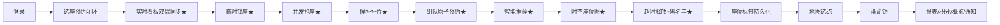

# pre/01 · 功能演示清单（对应 Q1）

- **文档目的**：给出尽量全面的演示功能清单，逐项标注创新点、页面路由、关键 API/SSE、触发方式与口播要点。
- **适用范围**：演示脚本编排与口播准备。
- **读者对象**：演示者、录制者、执行编排的 Agent。
- **相关文件**：[00-overview.md](00-overview.md)、[02-api-simulation.md](02-api-simulation.md)、[03-playwright-plan.md](03-playwright-plan.md)、[../client/src/router/index.js](../client/src/router/index.js)、[../client/src/api/index.js](../client/src/api/index.js)、[../docs/12-enhancement-plan.md](../docs/12-enhancement-plan.md)。

---

## 关键结论

- **★ = 答辩强亮点**：并发抢座、超时释放+黑名单、实时看板双端同步、时空座位图+时间轴、临时锁座、可解释智能推荐、候补自动补位、组队原子预约。
- 每个功能都能追溯到「路由 + API/SSE + 触发方式」，并标注该幕由 **PW（Playwright）** 还是 **API（脚本）** 主导。
- 触发方式列的「PW」指可见用户操作，「API」指需脚本产生的并发/背景/时间压缩。

---

## 一、演示顺序建议（叙事主线）

## 二、功能清单

> 表内 API 路径均为已核实（源 `client/src/api/index.js` 与后端控制器）。SSE 看板事件均在**事务提交后**广播。

### 1. 账号 · 登录 / 注册
| 项 | 内容 |
| --- | --- |
| 创新点 | 极光玻璃登录页、快捷登录、数字滚动微交互 |
| 路由/页面 | `/login`（`views/Login.vue`） |
| 关键 API | `POST /api/auth/login` → `{token,role,userInfo}`；`POST /api/auth/register`（需验证码 `GET /api/captcha`） |
| 触发方式 | **PW**：点「快捷登录」按钮（管理员/张三/李四），或注入 `localStorage` |
| 口播要点 | 登录态存 `localStorage(satoken/role/userInfo)`，REST 带 `satoken` 头，SSE 带 `token` 查询参数 |
| 注意 | 注册验证码无法 OCR，演示用快捷登录或注入 |

### 2. 预约闭环 · 选座 → 锁座 → 预约 → 签到 → 签退 → 取消
| 项 | 内容 |
| --- | --- |
| 创新点 | 30 分钟时间片建模；点座即临时锁 90s；成功彩带 |
| 路由/页面 | 选座 `/student/rooms/:roomId/seats`（`views/student/Seats.vue`）；记录 `/student/reservations` |
| 关键 API | `POST /api/holds`（点座）→ `POST /api/reservations`（确认）→ `POST /api/reservations/{id}/check-in` → `.../check-out`；`POST /api/reservations/{id}/cancel` |
| SSE | `seat_hold` → `seat_reserved` → `seat_in_use` → `seat_released` |
| 触发方式 | **PW**：`/student/rooms` 点「进入选座」→ 选日期/时段 → 点绿色空位 → 弹窗「确认预约」；记录页「签到」「签退」「取消」 |
| 口播要点 | 座位可预约的**最终结论由后端给出**（Redisson 锁 + MySQL 唯一索引）；签到有 15 分钟窗口，按钮在窗口外禁用 |

### 3. ★ 并发抢座（唯一性正确性）
| 项 | 内容 |
| --- | --- |
| 创新点 | Redisson 分布式锁降冲突 + MySQL 唯一索引 `uk_seat_date_slot` 最终兜底 |
| 路由/页面 | 观察端 `/admin/rooms/:roomId/board` 或学生 Seats 页 |
| 关键 API | 多个 token `Promise.all` 并发 `POST /api/reservations`（同一 `seatId+date+slot`） |
| SSE | 胜者触发一次 `seat_reserved` |
| 触发方式 | **API**：脚本 N 人抢一座，1 成功、N-1 返回 `SEAT_ALREADY_RESERVED`（Playwright 逐页点击不够并发） |
| 口播要点 | 「10 个请求同时打，只有 1 个成功」——正确性来源永远是 MySQL |

### 4. ★ 超时释放 + 爽约计数 + 黑名单
| 项 | 内容 |
| --- | --- |
| 创新点 | Redisson DelayedQueue 精确到期释放（非全表扫描）；爽约累计 3 次 → 7 天黑名单 |
| 路由/页面 | 观察端看板；管理端 `/admin/blacklist`（`views/admin/Blacklist.vue`） |
| 关键 API | `POST /api/reservations`（不签到）→ 到期自动 `EXPIRED_RELEASED`；`GET /api/admin/blacklist`；再预约被拒 `USER_IN_BLACKLIST` |
| SSE | `seat_released` |
| 触发方式 | **API**：需 15 分钟真实等待，或用 `:18081` 短签到窗口后端（`SEATWISE_SIGNIN_WINDOW_MINUTES=0`）压缩演示 |
| 口播要点 | 主动取消一般不计爽约；**超时未签到才计**；黑名单期内可登录/查历史但不能预约 |

### 5. ★ 座位实时看板（快照 + SSE 增量，双端同步）
| 项 | 内容 |
| --- | --- |
| 创新点 | 初始化快照 + SSE 增量推送；断线自动重连补拉快照；管理端「实时事件流」滚动可点击定位 |
| 路由/页面 | 管理端 `/admin/rooms/:roomId/board`（`views/admin/Board.vue`）；学生 Seats 页也实时 |
| 关键 API/SSE | 快照 `GET /api/study-rooms/{id}/board?date=&start=&end=`；订阅 `GET /api/board/stream?roomId=&date=&token=` |
| SSE 事件 | `seat_reserved` `seat_in_use` `seat_released` `seat_hold` `hold_released` `seat_disabled` `heartbeat` |
| 触发方式 | **PW（双窗）+ API**：两窗打开同一 `:roomId`，一端预约 → 另一端秒级变色；也可由 API 脚本产生变化 |
| 口播要点 | **本演示的主镜头**——双窗同框，强调「秒级同步」；机制是快照 + 增量事件 |

### 6. ★ 时空座位图 + 时间轴播放
| 项 | 内容 |
| --- | --- |
| 创新点 | 拖动时间轴选「预约开始时刻」，座位按「从该时刻起连续可用时长」绿色渐变发光；空间 + 时间联合查询 |
| 路由/页面 | `/student/spacetime`（`views/student/Spacetime.vue`），管理端 `/admin/spacetime` 复用 |
| 关键 API | `GET /api/study-rooms/{id}/replay?date=` |
| 触发方式 | **PW**：选房间/日期 → 拖 `el-slider` 或点「播放一天」→ 点发光座位弹「预约 HH:MM-HH:MM →」跳选座 |
| 口播要点 | 「一眼找到既现在空、又能久坐的位置」；点占用曲线柱可跳到最拥挤时刻 |

### 7. ★ 前端临时锁座（90s 倒计时）
| 项 | 内容 |
| --- | --- |
| 创新点 | 点座即用 Redis TTL 保留 90 秒，SSE 广播「选择中」，到期自动释放，避免多人误撞 |
| 路由/页面 | `/student/rooms/:roomId/seats`（`Seats.vue` + `components/SeatGrid.vue`） |
| 关键 API | `POST /api/holds`（返回 `expireAt/holdSeconds`）；`POST /api/holds/release` |
| SSE | `seat_hold` / `hold_released`；他人抢锁被拒 `SEAT_ALREADY_HELD` |
| 触发方式 | **PW（双窗，两学生）**：窗口 A 点座锁定并弹倒计时；窗口 B 端该座位显示黄色「🔒 选择中」 |
| 口播要点 | 锁只是体验优化，最终成功仍以预约落库为准；锁在确认预约后自动清理 |

### 8. ★ 座位级 · 多目标 · 可解释智能推荐（AI 助手）
| 项 | 内容 |
| --- | --- |
| 创新点 | LLM 只做「理解 + 措辞」，可用性由确定性引擎按 `reservation_slot` 计算；`score=0.30·连续+0.30·标签+0.20·楼栋+0.20·周边空位率`；离线自动降级规则引擎 |
| 路由/页面 | 学生端全局右下角 🤖 悬浮助手（`components/AiAssistant.vue`，挂在 `StudentLayout`） |
| 关键 API | `POST /api/ai/assistant {message,campusId,date}` → Top-3 `{seatNo,roomName,tags,reasons[],score,source}` |
| 触发方式 | **PW**：点 🤖 → 点示例词「下午2点安静靠窗坐两小时」或输入 → 「发送」→ 卡片点「前往预约 →」 |
| 口播要点 | 强调**可解释**而非黑箱：理由如「连续空闲 120 分钟 / 靠窗 / 有插座 / 周边空位率 98%」；`source` 标签「大模型」/「规则引擎」 |
| 关联 | 抢座失败（`SEAT_ALREADY_RESERVED`）→ Seats 页弹「🤖 为你找到替代方案」`GET /api/rooms/alternatives`，一键改约 |

### 9. ★ 候补队列自动补位（闭环）
| 项 | 内容 |
| --- | --- |
| 创新点 | 满员一键候补；座位释放（取消/超时/签退/自动完成）时 FIFO 匹配队首，复用 `hold:` 保留 60s + SSE + 站内通知；超时顺延下一位 |
| 路由/页面 | 加入在 Seats 页；管理在 `/student/waitlist`（`views/student/Waitlist.vue`） |
| 关键 API | `POST /api/waitlist`；`GET /api/waitlist/me`；`POST /api/waitlist/{id}/accept`；`POST /api/waitlist/{id}/cancel` |
| SSE/通知 | 释放触发 `seat_hold` + 每用户 `notification`（type=`WAITLIST`） |
| 触发方式 | **PW + API**：A（脚本或 PW）占满并候补，另一端取消 → 候补者窗口收到「🔒 席位已保留 60s」→ 点「立即确认预约」 |
| 口播要点 | 串联超时释放 / 取消 / 推送 / 临时锁的完整闭环；**需干净库** |

### 10. ★ 组队相邻原子预约
| 项 | 内容 |
| --- | --- |
| 创新点 | 一次为多人预约同排相邻座，按 seatId 升序取锁避免死锁，单事务批量插入，任一冲突整单回滚——分布式并发原子性 |
| 路由/页面 | Seats 页「组队相邻预约」`el-switch` + 成员分配 + 网格多选 |
| 关键 API | `POST /api/reservations/group {roomId,date,startTime,endTime,members[{seatId,username}]}` |
| 触发方式 | **PW** 演功能闭环（选连续座分配成员）；**API** 演并发原子性（两组抢重叠相邻座，恰好一组整体成功、败组回滚） |
| 口播要点 | 每座仍是独立 `reservation`，签到/超时/候补/看板完全复用；**需干净库** |

### 11. 座位标签可编辑 · 可持久化
| 项 | 内容 |
| --- | --- |
| 创新点 | 标签（靠窗/有插座/安静区/讨论区/靠门）与后端 `SeatTags` 对齐，随布局 JSON 持久化，供推荐引擎标签匹配 |
| 路由/页面 | 管理端 `/admin/rooms/:roomId/layout`（`views/admin/LayoutEditor.vue`） |
| 关键 API | `GET /api/study-rooms/{id}/layout`；`PUT /api/study-rooms/{id}/layout`（标签按 CSV 序列化） |
| 触发方式 | **PW**：右键 SEAT 格 → 勾选标签 → 点「保存布局」→ 刷新后仍在（持久化） |
| 口播要点 | 标签徽标（窗/插/静/讨/门）渲染在网格；改动随「保存布局」生效 |

### 12. 番茄钟（纯前端）
| 项 | 内容 |
| --- | --- |
| 创新点 | 自习专注工具；25 专注 / 5 短休 / 15 长休；环形进度 + 完成彩带/提示音 |
| 路由/页面 | `/student/pomodoro`（`views/student/Pomodoro.vue`） |
| 关键 API | 无（纯前端，计数存 `localStorage` `sw-pomo-YYYY-MM-DD`） |
| 触发方式 | **PW**：点「开始/暂停/重置/跳过」，切换模式 `el-segmented` |
| 口播要点 | 无后端依赖，Playwright 可完整驱动；可加速演示（说明是本地计时） |

### 13. 地图选点（Leaflet）
| 项 | 内容 |
| --- | --- |
| 创新点 | 楼栋坐标可视化选点，服务于「附近空位推荐」的距离排序 |
| 路由/页面 | 管理端 `/admin/locations`（`views/admin/Locations.vue`） |
| 关键 API | `PUT /api/buildings/{id}/location?latitude=&longitude=` |
| 触发方式 | **PW**：点「地图选点」→ 地图上点/拖标记 → 「确认坐标」→ 「保存坐标」 |
| 口播要点 | 与学生端 `/student/nearby`「附近有空位」`GET /api/rooms/nearest-available` 呼应 |

### 14. 补充 · 报表 / 积分 / 概览 Dashboard / 通知中心
| 项 | 内容 |
| --- | --- |
| 报表 | 管理端 `/admin/reports`（`Reports.vue`）ECharts：使用率/热门时段/取消率/爽约率/利用率排行；`GET /api/reports/summary`（聚合表非实时全表扫描） |
| 积分/排名 | `/student/ranking`（`Ranking.vue`）；`GET /api/scores/me`、`GET /api/scores/ranking` |
| 概览 | 学生 `/student/home`、管理 `/admin/dashboard`（`Home.vue`）卡片 + ECharts 迷你图 |
| 个人报告 | `/student/report`（`StudyReport.vue`）；`GET /api/me/study-report` 累计时长/守约率/近 7 天图 |
| 通知中心 | 顶部铃铛 `components/NotificationBell.vue`；每用户 SSE `GET /api/notifications/stream?token=`；`GET /api/notifications`、`/unread-count`、`/{id}/read`、`/read-all` |
| 触发方式 | **PW**：直接进页面展示；通知红点由候补/黑名单/积分事件（**API** 触发）点亮 |

## 三、功能 → 承担方速查

| 功能 | 主导 | 说明 |
| --- | --- | --- |
| 登录/注册、选座预约闭环、签到/签退/取消 | PW | 可见用户操作 |
| 实时看板双端同步 | PW 双窗 + API | 一端操作/脚本触发，另一端 SSE 观察 |
| 临时锁座、候补确认、组队闭环、推荐、时空图、标签、地图、番茄钟 | PW | UI 可完整驱动 |
| 并发抢座、组队并发原子性 | API | `Promise.all` 真实并发 |
| 超时释放 + 黑名单 | API | 15 分钟等待或 `:18081` 短窗口后端 |
| 造多状态数据 / 背景流量 | API | `stage.mjs` / `seed-*` |

> 详细脚本规格见 [02-api-simulation.md](02-api-simulation.md)；Playwright 逐步操作与选择器见 [03-playwright-plan.md](03-playwright-plan.md)。
