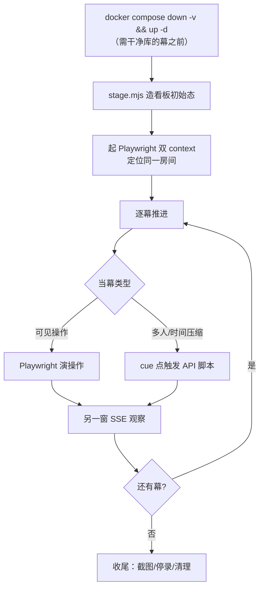

# pre/04 · 主控程序控制流

- **文档目的**：定义把「API 脚本（下层）」与「Playwright（上层）」编排成一次连贯演示的主控控制流、幕次与 cue 点。
- **适用范围**：整场演示/录制的调度。
- **读者对象**：编写主控编排的 Agent、演示者。
- **相关文件**：[00-overview.md](00-overview.md)、[01-feature-catalog.md](01-feature-catalog.md)、[02-api-simulation.md](02-api-simulation.md)、[03-playwright-plan.md](03-playwright-plan.md)。

---

## 关键结论

- 主控是**编排者**：负责「重置 → 造数 → 起双窗 → 逐幕推进（Playwright 演可见操作 / 在 cue 点触发 API 爆发，并在另一窗观察）→ 收尾」。
- 每个 cue 点都有**明确触发者、动作、预期可见现象、兜底**，保证现场可复现。
- 需要「恰好一个成功」类断言的幕（并发/候补/组队）**先重置库**；超时释放幕单独用 `:18081` 短窗口后端。

---

## 一、角色分工

| 角色 | 职责 | 载体 |
| --- | --- | --- |
| 主控程序 | 顺序/并行调度、按 cue 触发脚本、控制节奏 | Node 编排脚本（如 `demo/run.mjs`） |
| API 脚本（下层） | 多用户并发、造数、时间压缩 | `stage/race/waitlist-demo/group-demo/timeout-demo.mjs`（见 [02](02-api-simulation.md)） |
| Playwright（上层） | 关键可见操作 + 双窗观察 | `demo/pw-*.mjs`（见 [03](03-playwright-plan.md)） |

## 二、总控制流



## 三、幕次脚本（Run of Show）与 cue 点

> 顺序建议见 [01-feature-catalog.md](01-feature-catalog.md) 主线。可整场连录，也可按幕分段录后剪辑。

| 幕 | 窗口配置(A/B) | 触发者 | 动作 | 预期可见现象 | 兜底 |
| --- | --- | --- | --- | --- | --- |
| 0 预热 | — | 主控 | 重置库(按需) + `stage.mjs` | 看板有多状态座位 | 重跑 stage |
| 1 登录 | s1 / s2 | PW | 双窗快捷登录 | 各进入学生端 | 改用注入登录 |
| 2 预约闭环 | s1 / s2看板 | PW | A 选座→锁→确认预约 | A 座变红；B 端秒级变红 | 换未来时段重试 |
| 3 实时看板同步 | s1 / **admin**看板 | PW | A 再预约/签到 | 管理端看板 + 事件流秒级同步 | 确认两窗「实时连接中」 |
| 4 临时锁座 | s1点座 / s2 | PW | A 点座保持锁定 | B 端座位变黄「🔒 选择中」+ 倒计时 | 换空位重试 |
| 5 并发抢座★ | s1 / s2看板 | **主控→`race.mjs`** | 口播「8 人同时抢」触发 | 终端 1 成功/7 拒；看板该座变红一次 | 换 seat/时段；换学生避免限次 |
| 6 候补补位★ | **s2候补** / s1或脚本 | PW+主控 | 先占满→B 候补→释放 | B 收「保留 60s」+ 铃铛红点→确认成功 | **需干净库**；先重置 |
| 7 组队原子性★ | s1 / s2看板 | PW(闭环)+主控(`group-demo.mjs`) | 先演功能闭环，再演两组并发 | 胜方两座变红、败方座位不变 | **需干净库**；先重置 |
| 8 智能推荐★ | s1 / — | PW | 🤖→示例词→发送 | Top-3 可解释卡片，点卡跳选座 | 离线走规则引擎亦可 |
| 9 时空图★ | s1 / — | PW（前置 `seed-replay.mjs`） | 拖时间轴/播放一天 | 座位按连续可用时长发光 | 先铺 replay 数据 |
| 10 历史回放 | admin / — | PW | 看板→历史回放→播放/倍速 | 利用率仪表盘 + 曲线定位高峰 | — |
| 11 超时释放★ | s1 / s2看板 | 主控→`timeout-demo.mjs`(:18081) | 预约不签到 | 座位约 8s 后自动回 FREE；黑名单+1 | 无 :18081 则仅讲机制 |
| 12 座位标签 | admin / — | PW | 右键勾标签→保存布局→刷新 | 徽标持久化仍在 | — |
| 13 地图选点 | admin / — | PW | 地图选点→确认→保存坐标 | 坐标写回楼栋 | — |
| 14 番茄钟 | s1 / — | PW | 开始→跳过 | 环形进度 + 完成彩带 | 说明本地计时 |
| 15 报表/积分/概览/通知 | admin/s1 | PW | 逐页展示 | ECharts 图 + 通知红点 | 数据可先造 |

> `★` 幕为强亮点，建议重点打磨镜头（双窗同框）。

## 四、主控编排伪代码（本次不落地实现）

```text
// demo/run.mjs —— 仅编排，不含业务逻辑；子脚本见 02/03
const ROOM=1, DATE=tomorrow(), SLOT='14:00-16:00'

async function main() {
  // 幕 0：预热（幕 6/7 前需 resetDb()）
  await sh('stage.mjs', { ROOM, DATE, SLOT })

  // 起双窗（两个 browserContext）
  const A = await openContext('student1')     // 主操作
  let  B = await openContext('student2')       // 观察；演管理端幕时切 admin

  // 幕 1-4：可见操作，B 观察
  await pw.login(A); await pw.login(B)
  await pw.reserveFlow(A, ROOM, DATE, SLOT)    // B 端看板变红
  B = await switchTo(B, 'admin', boardUrl(ROOM, DATE))  // 幕 3 切管理端
  await pw.holdSeat(A, ROOM, DATE, SLOT)       // 幕 4：B 端变黄

  // 幕 5：并发爆发（cue）
  say('现在 8 个人同时抢这一个座')
  await sh('race.mjs', { ROOM, DATE, SLOT, N: 8 })   // 观察窗看板变红

  // 幕 6/7：需干净库
  await resetDb()
  await sh('stage.mjs', { ROOM, DATE, SLOT })
  await pw.joinWaitlist(B) ; await sh('waitlist-demo.mjs', {…}) ; await pw.acceptOffer(B)
  await pw.groupReserve(A, …) ; await sh('group-demo.mjs', { ROOM, DATE, SLOT })

  // 幕 8-10：推荐/时空图/回放
  await pw.aiAssistant(A)
  await sh('seed-replay.mjs') ; await pw.spacetime(A) ; await pw.replay(adminCtx)

  // 幕 11：超时释放（独立后端）
  await sh('timeout-demo.mjs', { BASE: 'http://localhost:18081' })

  // 幕 12-15：标签/地图/番茄钟/报表
  await pw.editTags(adminCtx) ; await pw.mapPick(adminCtx)
  await pw.pomodoro(A) ; await pw.reports(adminCtx)

  await cleanup()   // 停录、关窗
}
```

- `sh(script, env)`：以指定 env 调 `node scripts/demo/<script>`，回传终端输出供主控判断成功数。
- `pw.*`：Playwright 动作封装（见 [03](03-playwright-plan.md) 第五节）。
- 并行点：仅并发爆发用 `Promise.all`（在子脚本内部）；主控主体顺序执行以对齐口播。

## 五、录制与复现建议

- **分幕录制**：每幕独立可重跑，失败只重录该幕；强亮点幕（5/6/7/9/11）预演一遍再正式录。
- **重置命令**：`docker compose down -v && docker compose up -d`，再 `node scripts/demo/stage.mjs`。
- **限次规避**：同一学生一天最多 3 次预约；抢座/组队多幕轮换 student3~8 或每次换时段。
- **超时幕**：提前起好 `:18081` 短窗口后端（命令见 [../RUN.md](../RUN.md)），录完 `docker rm -f seatwise-backend-tmp`。
- **节奏对齐**：cue 点触发 API 脚本的瞬间与口播「同时抢/释放/两组一起」对齐，画面张力最强。
- **兜底话术**：并发/候补依赖真干净库，若现场状态不确定，先走「重置 + stage」再演。

## 六、完成自检（对齐三问闭环）

- Q1：[01](01-feature-catalog.md) 覆盖全部功能且标注创新点与承担方。
- Q2：[02](02-api-simulation.md) 给出复用矩阵 + 新脚本规格（幂等/参数化/cue）。
- Q3：[03](03-playwright-plan.md) 给出能力边界表，明确 Playwright 做不了的三件事交回下层。
- 本文件：每个 cue 点均有触发者/动作/预期现象/兜底，主控伪代码串起全场。
