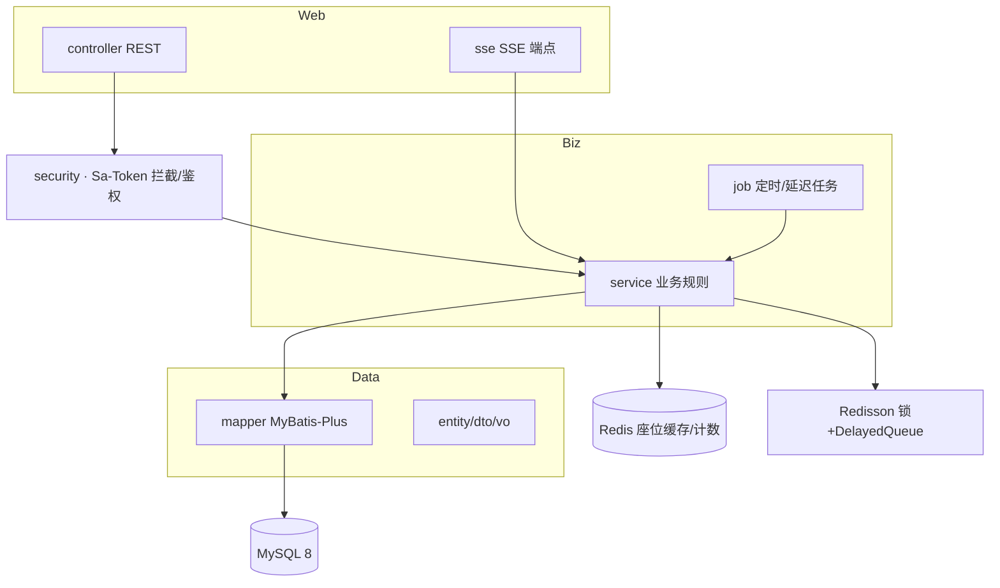

# server/00 · 服务端整体架构

- **文档目的**：描述后端分层、包结构与中间件职责。
- **适用范围**：`server` 工程结构。
- **读者对象**：后端/Agent。
- **相关文件**：[01-domain-model](01-domain-model.md)、[05-reservation-concurrency-control](05-reservation-concurrency-control.md)、[07-sse-realtime-board](07-sse-realtime-board.md)。

## 关键结论
- 分层：controller → service → mapper → MySQL；service 旁挂 Redis/Redisson、SSE、Job。
- Redis/Redisson 为加速与调度，MySQL 为正确性来源。

## 一、分层架构图


## 二、包结构（建议）
```
com.seatwise
├── controller      # REST 入口
├── sse             # SseEmitter 端点与管理
├── service         # 业务规则(impl 分离)
├── mapper          # MyBatis-Plus Mapper
├── entity          # 数据库实体
├── dto             # 入参
├── vo              # 出参
├── config          # Redisson/Sa-Token/Knife4j/Mybatis 配置
├── job             # 超时释放、统计聚合、积分结算
├── security        # 鉴权、当前用户
├── common          # 统一响应、错误码、异常处理、常量
└── SeatWiseApplication.java
```

## 三、各层职责
| 层 | 职责 | 禁止 |
| --- | --- | --- |
| controller | 参数校验、调用 service、返回统一结构 | 写业务规则 |
| service | 业务规则、锁、事务、缓存、推送 | 直接返回实体 |
| mapper | SQL 与持久化 | 承载业务 |
| job | 延迟/定时任务 | 绕过 service 直接改库 |
| sse | 连接管理与推送 | 决定业务状态 |

## 四、中间件职责
| 中间件 | 职责 |
| --- | --- |
| MySQL 8 | 主存储、事务、唯一索引兜底 |
| Redis 7 | 座位状态缓存、单日计数、SSE 辅助 |
| Redisson | 分布式锁、DelayedQueue 延迟释放 |
| Sa-Token | 登录态、角色鉴权 |
| Knife4j | 接口文档 `/doc.html` |

## 五、统一响应与错误处理
统一响应 `{code,message,data,traceId}`；全局异常处理器把业务异常转错误码，未知异常转 5xx 并记 traceId。错误码见 [03](03-api-design.md) 与 [../GLOSSARY.md](../GLOSSARY.md)。

## 实现约束
- service 实现类持有锁与事务边界；controller 保持瘦。
- 配置集中在 config 包；常量集中在 common。

## 验收标准
- 分层清晰，无 controller 直连 mapper 越过 service 的业务写。

## 给 AI Coding Agent 的提示
新增功能按包归位；预约/超时/SSE 相关逻辑放对应 service，勿散落。
