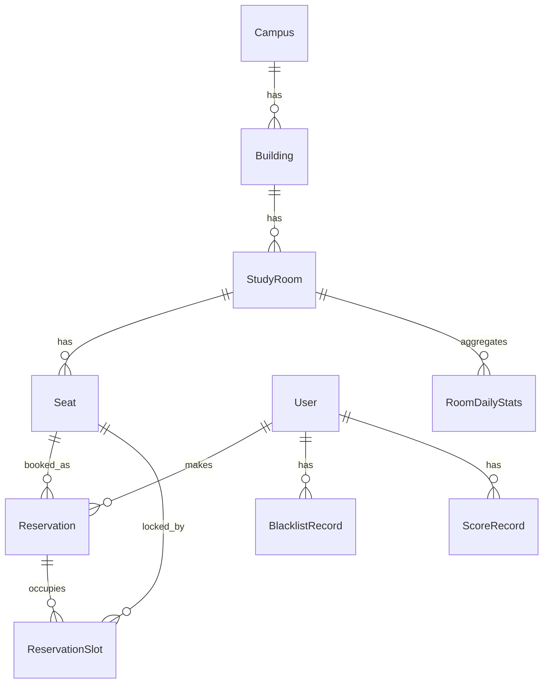
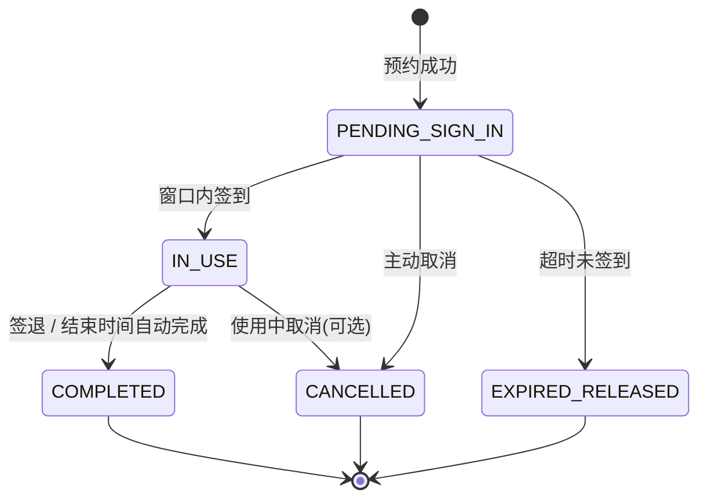
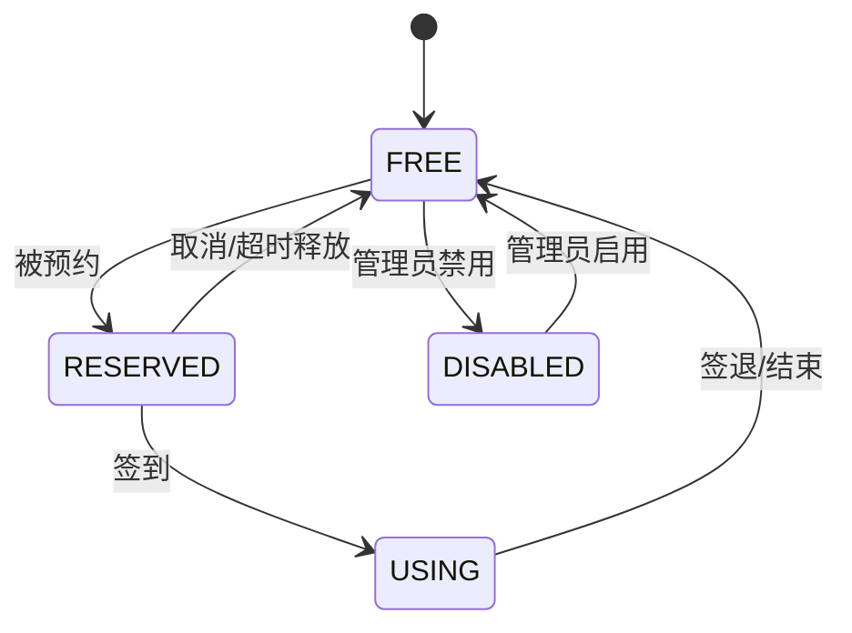

# server/01 · 领域模型

- **文档目的**：定义核心实体、关系与状态机。
- **适用范围**：后端领域层。
- **读者对象**：后端/Agent。
- **相关文件**：[02-database-schema](02-database-schema.md)、[05-reservation-concurrency-control](05-reservation-concurrency-control.md)、[../GLOSSARY.md](../GLOSSARY.md)。

## 关键结论
- 预约拆为 **Reservation（主记录）+ ReservationSlot（时间片占用）**，并发正确性落在 slot 唯一约束。
- 座位可预约条件：`cell_type=SEAT` 且对应时间片无占用。

## 一、核心实体与职责
| 实体 | 职责 | 核心字段 |
| --- | --- | --- |
| User | 用户(学生/管理员) | id,username,role,credit_score,no_show_count |
| Campus | 校区 | id,name,latitude,longitude,map_x,map_y |
| Building | 楼栋 | id,campus_id,name,latitude,longitude,map_x,map_y |
| StudyRoom | 自习室 | id,building_id,floor_no,name,open_start,open_end,status,latitude,longitude |
| Seat | 座位 | id,room_id,row_index,col_index,cell_type,seat_no,enabled |
| Reservation | 预约主记录 | id,user_id,seat_id,room_id,date,start_slot,end_slot,status,check_in_time,check_out_time |
| ReservationSlot | 时间片占用 | id,reservation_id,seat_id,date,slot_index |
| BlacklistRecord | 黑名单 | id,user_id,reason,start_time,end_time,active |
| ScoreRecord | 积分流水 | id,user_id,change,reason,ref_reservation_id,created_time |
| RoomDailyStats | 日聚合 | id,room_id,date,usage_rate,cancel_rate,no_show_rate,... |
| OperationLog | 操作日志 | id,user_id,action,detail,created_time |
| RoomLocation | 位置(可并入房间) | room_id,latitude,longitude,map_x,map_y |
| Notification(可选) | 通知 | id,user_id,type,title,content,status |

## 二、实体关系

## 三、时间片模型
- 一天按 30 分钟切片，`slot_index` 从 0 起（如 08:00→16、以固定基准计算，前后端一致）。
- 预约起止时间 → `[start_slot, end_slot)` → 展开为 `slot_index` 列表 → 每片一行 ReservationSlot。
- 唯一约束 `(seat_id, date, slot_index)` 保证同座同片仅一条。

## 四、预约状态机

> `IN_USE→COMPLETED` 有两条路径：学生主动 `check-out`，或预约结束时间到达时由**自动完成任务**收尾（避免座位永久停留在 USING）。二者都会释放 slot、复位座位为 FREE 并推送 SSE `seat_released`。详见 [06 §八](06-timeout-release-and-blacklist.md)。

## 五、座位状态机

> 注：座位状态是**特定日期+时间片下的视图状态**，由 ReservationSlot 与 Seat.enabled 推导，缓存于 Redis。

## 六、黑名单规则
- 触发：`no_show_count` 达阈值（默认 3）。
- 效果：生成 active 的 `blacklist_record`，`end_time = now + 7 天`。
- 约束：仅限制预约，不限制登录/查看。到期或管理员解除后失效。

## 七、积分规则（MVP+）
| 事件 | 分值 |
| --- | --- |
| 正常完成 COMPLETED（主动签退或自动完成） | +2 |
| 开始前 >30 分钟取消 | 0 |
| 开始前 30 分钟内取消 | -1 |
| 超时未签到 | -3 |
| 使用后未主动签退(可选，MVP 默认不启用) | 可扣 |
每次变更写 ScoreRecord 并更新 `credit_score`。详见 [09](09-score-ranking-design.md)。

## 八、最近空位推荐涉及实体（MVP+）
Campus/Building/StudyRoom 的坐标字段 + 实时空位统计（由 ReservationSlot 与 Seat 推导）。详见 [10](10-nearest-available-room-design.md)。

## 实现约束
- 状态流转只允许状态机所示路径。
- ReservationSlot 与 Reservation 在同一事务内写入。

## 验收标准
- 非法状态流转被拒绝；slot 唯一约束生效。

## 给 AI Coding Agent 的提示
新增字段/实体先更新本文件与 [02](02-database-schema.md)；不要引入图外状态。
