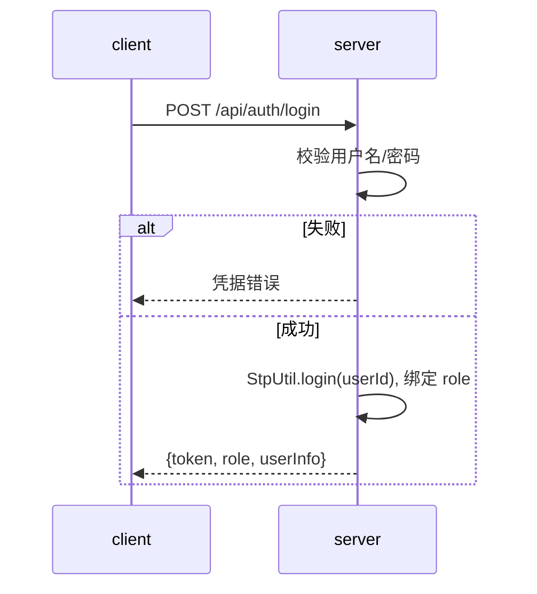
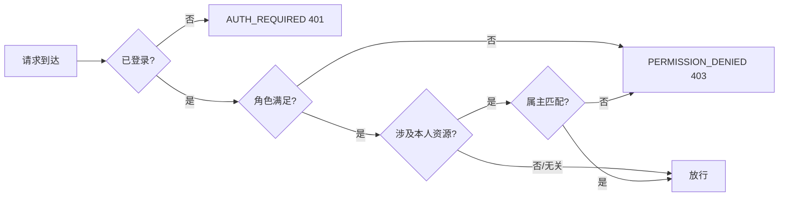

# server/04 · 认证鉴权

- **文档目的**：定义基于 Sa-Token 的登录与角色权限。
- **适用范围**：全部受保护接口。
- **读者对象**：后端/Agent。
- **相关文件**：[03-api-design](03-api-design.md)、[06-timeout-release-and-blacklist](06-timeout-release-and-blacklist.md)、[../docs/01-requirements.md](../docs/01-requirements.md)。

## 关键结论
- 两角色：`STUDENT` / `ADMIN`。学生只能操作本人预约；基础数据仅 ADMIN。
- **黑名单是业务态而非权限角色**：黑名单用户可登录/查看，仅预约动作被拒。

## 一、Sa-Token 方案
- 登录签发 token；请求头携带（约定 `satoken: <token>`）。
- 角色/权限用 Sa-Token 的 `StpUtil` 校验；接口用注解或拦截器鉴权。
- 当前无注册流程，用户由**管理员预置或种子数据初始化**；注册属后续扩展功能，不纳入 MVP。

## 二、登录流程

## 三、Token 策略
| 项 | 约定 |
| --- | --- |
| 有效期 | 例如 7 天（可配置） |
| 续签 | 活跃续签(可选) |
| 存储 | Sa-Token 默认(可接 Redis 集中管理) |
| 登出 | `StpUtil.logout()` |

## 四、权限矩阵
| 资源/动作 | STUDENT | ADMIN | 黑名单STUDENT |
| --- | --- | --- | --- |
| 登录/查看本人信息 | ✅ | ✅ | ✅ |
| 筛选/查看座位看板 | ✅ | ✅ | ✅ |
| 提交预约 | ✅ | ❌(非管理职责) | ❌(USER_IN_BLACKLIST) |
| 签到/取消本人预约 | ✅(仅本人) | — | ✅(仅本人) |
| 查看本人预约/积分 | ✅ | — | ✅ |
| 基础数据 CRUD/排布 | ❌ | ✅ | ❌ |
| 报表/黑名单管理/积分记录 | ❌ | ✅ | ❌ |

## 五、越权防护
- 学生操作预约时校验 `reservation.user_id == 当前用户`，否则 `PERMISSION_DENIED`。
- 管理接口统一要求 `ADMIN` 角色。

### Token 传递例外：SSE
除 SSE 端点外，所有接口 token 走请求头 `satoken`。SSE 端点 `/api/board/stream` 因浏览器 `EventSource` 不能自定义请求头，token 改由**查询参数 `token=<token>`** 传递，服务端建连时以同样规则校验登录态。详见 [07-sse-realtime-board](07-sse-realtime-board.md)。

## 六、密码安全
> **已知缺陷**：当前登录接口密码以**明文传输**，存在中间人窃听风险。详见 [docs/08-known-issues.md](../docs/08-known-issues.md) §P4。

| 层级 | 当前状态 | 建议方案 |
| --- | --- | --- |
| 传输层 | 明文 `{ "password": "***" }` | 生产环境强制 HTTPS；前端可哈希后传输 |
| 存储层 | 明文存储（当前） | 必须加密存储，具体加密算法待确认 |

**建议修复方案**：
1. 部署时配置 HTTPS，保证传输层加密。
2. 后端存储密码前先加密（具体加密算法待定）。
3. 注册接口同理，密码在传输和存储两个环节均需保护。

## 七、鉴权流程

## 实现约束
- 黑名单校验在**预约 service**内做，不在鉴权层拦截读接口。
- 属主校验在 service 层强制，不依赖前端。

## 验收标准
- 未登录→401；学生访问管理接口→403；操作他人预约→403；黑名单预约→`USER_IN_BLACKLIST` 但可读。

## 给 AI Coding Agent 的提示
新增接口在 [03](03-api-design.md) 标权限并在此矩阵登记；黑名单是业务校验，别把它做成角色。
