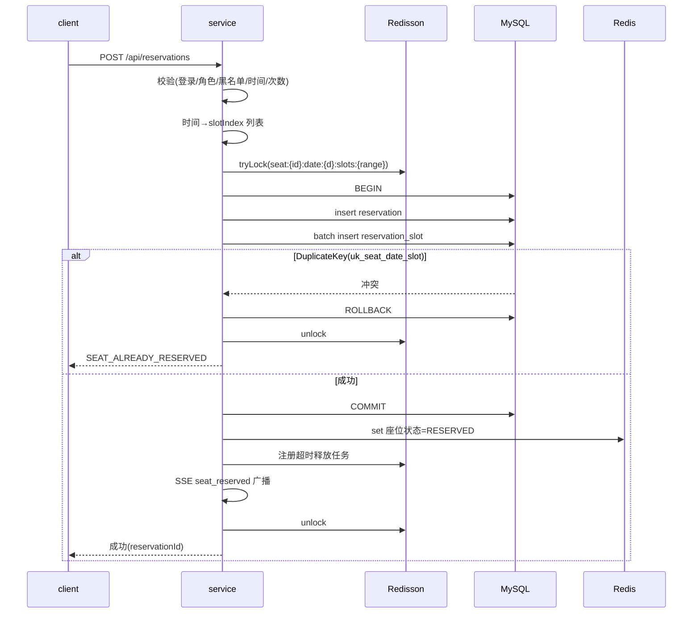

# server/05 · 预约并发控制（核心）

- **文档目的**：定义预约的并发正确性方案——Redisson 锁 + MySQL 唯一索引兜底 + 时间片模型。
- **适用范围**：预约提交写路径。
- **读者对象**：后端/Agent（改预约逻辑必读）。
- **相关文件**：[02-database-schema](02-database-schema.md)、[01-domain-model](01-domain-model.md)、[07-sse-realtime-board](07-sse-realtime-board.md)、[06-timeout-release-and-blacklist](06-timeout-release-and-blacklist.md)。

## 关键结论
- **锁降低冲突、唯一索引保证正确**：二者缺一不可。锁失效时唯一索引兜底；Redis 不可用不影响正确性。
- 并发去重的原子点是 `reservation_slot (seat_id,date,slot_index)` 唯一约束的插入判重。

## 一、并发抢座问题定义
两个（或更多）学生几乎同时预约**同一座位、同一日期、同一时间片**，系统必须只允许一人成功。

## 二、为什么这些做法不可靠
| 做法 | 为什么不可靠 |
| --- | --- |
| 前端禁用按钮 | 多客户端各自禁用，跨端无互斥；可绕过 |
| 先查空位再插入 | 查与插之间存在竞态窗口，两请求都查到“空”再都插入 |
| 只用 Redis 判断 | Redis 可失效/丢数据、无事务级唯一约束，不能作最终正确性 |

## 三、正确方案组合
1. **Redisson 分布式锁**：按座位+日期+时段加锁，串行化同资源请求，降低冲突与无谓回滚。
2. **MySQL 唯一索引兜底**：即便锁异常/超时导致并发进入，`uk_seat_date_slot` 在插入时原子判重，冲突方回滚。
3. **时间片模型**：预约拆成 30 分钟片逐行插入 slot，使“同座同片”可被唯一索引覆盖。

## 四、推荐预约流程（权威步骤）
1. 校验登录。
2. 校验角色（STUDENT）。
3. 校验黑名单（命中→`USER_IN_BLACKLIST`）。
4. 校验预约时间（对齐/起<止/开放内→否则 `INVALID_TIME_RANGE`）。
5. 校验单日次数（超单日上限 `SEATWISE_DAILY_LIMIT`，默认 3 次→`DAILY_LIMIT_EXCEEDED`；单次时长超上限 `SEATWISE_MAX_SLOTS_PER_RESERVATION`，默认 8 片=4 小时→`INVALID_TIME_RANGE`）。
6. 校验用户自身时段冲突（本人在该 `date` 已有覆盖相同时间片且未取消/未释放的预约→`RESERVATION_TIME_CONFLICT`）。
7. 将起止时间转换为 `slot_index` 列表。
8. 生成锁 key：`seat:{seatId}:date:{date}:slots:{slotRange}`。
9. Redisson 加锁（带等待/租约超时）。
10. 开启数据库事务。
11. 创建 `reservation` 主记录。
12. 批量插入 `reservation_slot`（每片一行）。
13. 若唯一索引冲突（DuplicateKey）→ 回滚 → 返回 `SEAT_ALREADY_RESERVED`。
14. 写 Redis 座位状态缓存（该片=RESERVED）。
15. 创建超时未签到释放任务（Redisson DelayedQueue，见 [06](06-timeout-release-and-blacklist.md)）。
16. 发送 SSE `seat_reserved` 事件（见 [07](07-sse-realtime-board.md)）。
17. 释放锁（finally 保证）。
18. 返回预约成功。

## 五、时序图

## 六、事务边界
- 锁在事务外获取、事务内写库；`unlock` 在 finally。
- reservation 与全部 slot 在**同一事务**，全成或全败。
- Redis 写缓存与 SSE 推送在事务**提交后**执行（避免脏推送）。

## 七、幂等性
- 客户端可传幂等键（可选）；服务端对“同用户同座同片重复提交”依赖唯一索引天然幂等（第二次冲突）。
- 重试安全：失败无副作用（事务回滚 + 未提交不推送）。

## 八、回滚策略
- 任一 slot 冲突→整单回滚，不留半占用。
- 提交后若 Redis/SSE 失败，不回滚库（以库为准），记录日志，缓存可回源重建。

## 九、高并发错误提示
冲突方统一返回 `SEAT_ALREADY_RESERVED`，前端提示并刷新座位状态。

## 十、Redis 缓存与 SSE 时机
- **提交成功后**才写缓存与推送，保证客户端看到的都是已确认状态。
- 缓存与库不一致时以库为准，可通过看板快照回源重建。

## 实现约束
- 禁止移除唯一索引兜底；禁止仅凭 Redis 判成功；禁止查后插作为唯一手段。
- 锁 key 覆盖座位+日期+时段；释放必经 finally。

## 验收标准
- 10 并发同座同片仅 1 成功；断开 Redis 后仍不双占（见 [12](12-server-test-and-acceptance.md)）。

## 给 AI Coding Agent 的提示
改此流程严格保序步骤 7→18；任何“优化”不得削弱唯一索引兜底或把正确性交给 Redis/前端。
