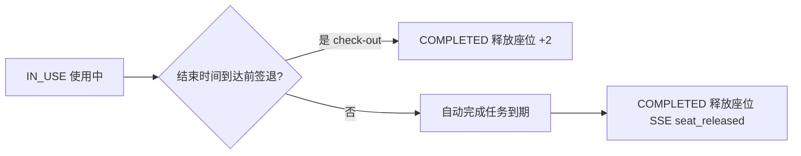

# server/06 · 超时释放与黑名单

- **文档目的**：定义签到超时自动释放、爽约计数与黑名单机制。
- **适用范围**：签到窗口、超时释放任务、黑名单。
- **读者对象**：后端/Agent（改超时/黑名单必读）。
- **相关文件**：[05-reservation-concurrency-control](05-reservation-concurrency-control.md)、[01-domain-model](01-domain-model.md)、[09-score-ranking-design](09-score-ranking-design.md)。

## 关键结论
- 超时释放以 **Redisson DelayedQueue / Redis ZSet** 为主，**全表扫描仅兜底**。
- 主动取消一般不计爽约；**超时未签到计爽约**，累计达阈值进黑名单。

## 一、签到截止规则
- 默认：预约开始后 **15 分钟**内必须签到（可配置）。
- 超过窗口仍未签到 → 状态置 `EXPIRED_RELEASED`，释放座位。
- **已知缺陷**：签到窗口规则未向学生端展示，且缺乏「禁止提前签到」的校验（详见 [docs/09-known-issues-v2.md](../docs/09-known-issues-v2.md) §Q1）。

## 二、超时释放调度方案
| 方案 | 角色 | 说明 |
| --- | --- | --- |
| Redisson DelayedQueue | 主 | 预约成功时投递到期任务(delay=开始时刻+15min-now) |
| Redis ZSet(score=到期时间戳) | 备选主 | 轮询到期成员处理 |
| 每分钟扫全表 | 兜底 | 仅补偿漏处理，不作主方案（全表扫描不可扩展） |

**为什么不把每分钟扫全表作为最终方案**：随预约量增长全表扫描成本线性上升且延迟不精确；延迟队列 O(1) 触达、精确到秒，扫表只用于对账补偿。

## 三、超时释放事务
到期任务执行：
1. 读预约，校验仍为 `PENDING_SIGN_IN`（已签到/已取消→跳过，幂等）。
2. 事务内：状态→`EXPIRED_RELEASED`，删除对应 `reservation_slot` 行。
3. `no_show_count + 1`。
4. （MVP+）写 `score_record` 扣 3 分并更新 `credit_score`。
5. 更新 Redis 座位状态=FREE。
6. 推送 SSE `seat_released`。
7. 若 `no_show_count` 达阈值 → 写 `blacklist_record`。

```mermaid
sequenceDiagram
    participant Q as DelayedQueue
    participant S as service
    participant DB as MySQL
    Q-->>S: 到期(reservationId)
    S->>DB: 查状态
    alt 非 PENDING_SIGN_IN
        S->>S: 幂等跳过
    else 仍待签到
        S->>DB: BEGIN;状态=EXPIRED_RELEASED;删 slot;no_show_count+1
        S->>DB: (MVP+) score_record -3
        S->>DB: COMMIT
        S->>S: Redis 座位=FREE; SSE seat_released
        S->>DB: 达阈值→insert blacklist_record
    end
```

## 四、黑名单规则
| 项 | 默认 |
| --- | --- |
| 爽约阈值 | 3 次 |
| 黑名单期限 | 7 天 |
| 限制 | 不能预约(`USER_IN_BLACKLIST`) |
| 不限制 | 登录、查看历史/积分 |
| 解除 | 到期自动失效或管理员手动解除 |

## 五、取消与爽约的区分
| 行为 | 计爽约? | 积分(MVP+) |
| --- | --- | --- |
| 开始前 >30 分钟主动取消 | 否 | 0 |
| 开始前 30 分钟内取消 | 否(不计爽约) | -1 |
| 超时未签到 | 是(no_show+1) | -3 |
| 使用后未签退(可选) | 可选 | 可选扣 |

## 六、黑名单解除流程
```mermaid
flowchart LR
    A[blacklist_record active=1] --> B{到期 or 管理员解除?}
    B -- 到期 --> C[定时/查询时置 active=0]
    B -- 管理员 --> D[/api/admin/blacklist/id/release]
    C --> E[用户恢复预约能力]
    D --> E
```

## 七、幂等与并发
- 到期任务必须幂等：先判状态再处理，重复投递不重复扣分/释放。
- 释放与签到可能竞争：签到成功应取消延迟任务；任务执行时再次校验状态兜底。

## 八、使用中座位的收尾：签退与自动完成
签到后座位进入 `IN_USE`/USING，必须有明确的收尾路径把它释放回 FREE，否则座位永远无法复用。收尾有两条路径：

| 路径 | 触发 | 效果 |
| --- | --- | --- |
| 主动签退 | 学生调 `POST /api/reservations/{id}/check-out` | `IN_USE→COMPLETED`，释放座位，SSE `seat_released`，（MVP+）+2 |
| 自动完成 | **预约结束时间**到达仍为 `IN_USE` | `IN_USE→COMPLETED`，释放座位，SSE `seat_released` |

**自动完成任务**与超时释放同机制：预约签到成功时投递一个到期时间为「预约结束时刻」的 Redisson DelayedQueue 任务（或 ZSet），全表扫描仅作兜底补偿。

自动完成事务（幂等）：
1. 读预约，校验仍为 `IN_USE`（已签退/已取消→跳过）。
2. 事务内：状态→`COMPLETED`，删除对应 `reservation_slot` 行，记录 `check_out_time`（系统自动）。
3. Redis 座位状态=FREE。
4. 推送 SSE `seat_released`。
5. （MVP+，可选）是否对「未主动签退」扣分由积分规则决定（见 [09](09-score-ranking-design.md)），默认自动完成不额外扣分。



> 与超时释放的区别：超时释放处理的是 `PENDING_SIGN_IN`（未签到爽约，扣分+计爽约）；自动完成处理的是 `IN_USE`（已签到正常结束，不计爽约）。两类任务都必须幂等且在执行时二次校验状态。

## 实现约束
- 释放=删除 slot + 状态流转，二者同事务。
- 扣分/黑名单在释放事务后或同事务内一致处理，避免部分成功。
- 阈值/窗口/期限走配置常量（便于 [../docs/05](../docs/05-extension-design.md) 规则中心化）。

## 验收标准
- 超时 15 分钟未签到自动释放并复位 FREE；爽约累计达阈值进黑名单；签到后不再被释放。

## 给 AI Coding Agent 的提示
不要用扫全表当主方案；释放任务务必幂等；签到成功记得取消对应延迟任务。
