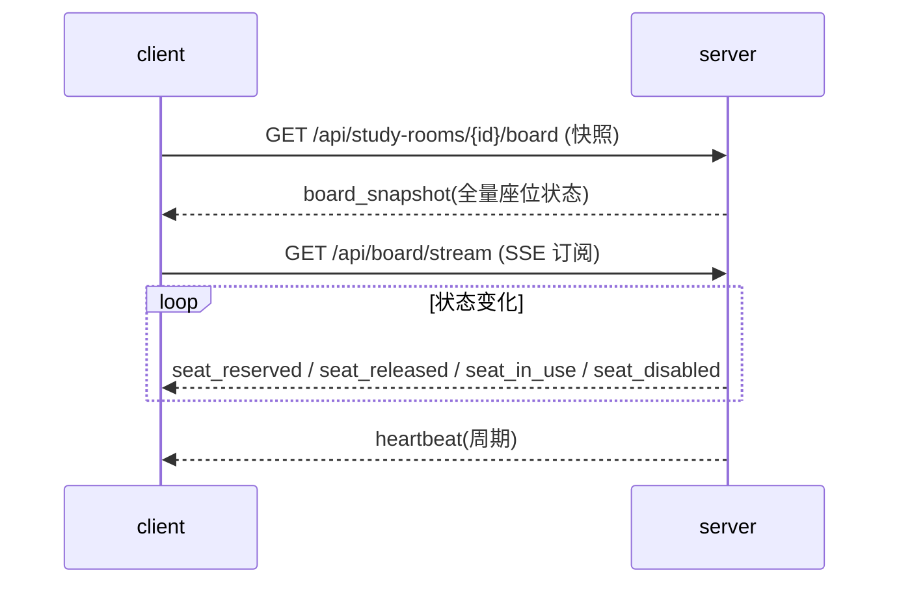

# server/07 · SSE 实时看板

- **文档目的**：定义座位看板的实时推送方案（快照 + SSE 增量）。
- **适用范围**：看板/选座实时更新。
- **读者对象**：后端/Agent（改 SSE 必读）。
- **相关文件**：[05-reservation-concurrency-control](05-reservation-concurrency-control.md)、[../client/04-seat-grid-and-heatmap.md](../client/04-seat-grid-and-heatmap.md)、[03-api-design](03-api-design.md)。

## 关键结论
- **初始化快照 + 增量事件**：进入拉一次全量，之后只推变化。
- SSE 只做**服务端→客户端单向**推送；需要双向再评估 WebSocket。

## 一、为什么用 SSE 而非 WebSocket
| 维度 | SSE | 结论 |
| --- | --- | --- |
| 通信方向 | 单向(服务端→客户端) | 座位推送正是单向 |
| 复杂度 | 基于 HTTP，简单、易过代理 | 更低 |
| 自动重连 | 浏览器原生支持 | 省事 |
| 双向需求 | 无 | 暂不需要 WebSocket |

## 二、快照 + 增量模型


## 三、连接与参数
- 快照：`GET /api/study-rooms/{id}/board?date=&start=&end=`（走请求头鉴权）
- 订阅：`GET /api/board/stream?roomId=&date=&start=&end=&token=`（text/event-stream）

### 鉴权
浏览器原生 `EventSource` **不能自定义请求头**，无法携带 `satoken` 头。因此 SSE 端点的登录态通过 **查询参数 `token=<token>`** 传递，服务端在建连时校验；校验失败返回 401 并拒绝建连。其余 REST 接口仍走请求头（见 [04-auth-rbac](04-auth-rbac.md)）。前端封装见 [../client/07-api-calling-design.md](../client/07-api-calling-design.md)。

## 四、事件类型
| 事件 | 触发 | payload |
| --- | --- | --- |
| `board_snapshot` | 首次/重连补发(可选) | 全量座位状态 |
| `seat_reserved` | 预约成功 | seatId,slotRange |
| `seat_released` | 取消/超时释放 | seatId,slotRange |
| `seat_in_use` | 签到 | seatId |
| `seat_disabled` | 管理员禁用 | seatId |
| `heartbeat` | 周期保活 | ts |

事件示例：
```
event: seat_reserved
data: {"roomId":10,"date":"2026-07-06","seatId":101,"slotRange":[28,32],"mine":false}
```

## 五、SseEmitter 管理
- 按 `roomId + date + 时段` 维度维护订阅者集合（`Map<key, Set<SseEmitter>>`）。
- 连接建立注册、完成/超时/异常时移除；发送失败清理死连接。
- 广播：状态变更事件遍历对应 key 的 emitter 集合下发。

## 六、心跳
周期（如 15s）发送 `heartbeat`，客户端据此判活；服务端设置 emitter 超时并在超时回调清理。

## 七、断线重连
- 客户端指数退避重连（见 [../client/04](../client/04-seat-grid-and-heatmap.md)）。
- 重连后**重新拉取快照**校正，避免断线期间漏事件导致漂移。

## 八、多客户端订阅
同 key 多个 emitter 全部收到广播；不同时段/房间互不影响。

## 九、Redis 缓存与数据库关系
- 座位状态缓存于 Redis，快照可优先读缓存，缺失回源 MySQL 重建。
- 事件在**业务事务提交后**广播，保证推送的都是已确认状态（见 [05](05-reservation-concurrency-control.md)）。
- 缓存与库不一致时以库为准；快照回源即可自愈。

## 实现约束
- 只推增量 + 周期心跳；勿全量轮询。
- 推送发生在事务提交后；失败仅记录，不回滚业务。
- emitter 集合并发安全，及时清理死连接。

## 验收标准
- 两端同 key，一端操作另一端秒级更新；断线重连后状态与库一致；有心跳。

## 给 AI Coding Agent 的提示
新增座位状态变更动作时，务必在提交后广播对应事件；不要在事务中间推送。
