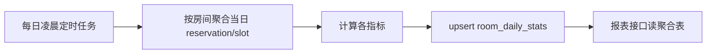

# server/08 · 统计报表

- **文档目的**：定义报表指标口径、聚合方案与接口返回结构。
- **适用范围**：管理端报表。
- **读者对象**：后端/Agent。
- **相关文件**：[02-database-schema](02-database-schema.md)、[03-api-design](03-api-design.md)、[../client/03-admin-side-design.md](../client/03-admin-side-design.md)。

## 关键结论
- 报表**读聚合表 `room_daily_stats`**，由定时任务生成；不实时全表扫描 reservation。

## 一、核心指标与口径
| 指标 | 口径 |
| --- | --- |
| 日均使用率 usage_rate | 已占用座位·时间片 / 可用座位·开放时间片 |
| 热门时段 peak_slot | 各 slot 占用数最高的时段 |
| 取消率 cancel_rate | CANCELLED / 总预约 |
| 爽约率 no_show_rate | EXPIRED_RELEASED / 总预约 |
| 利用率排行 | 各自习室 usage_rate 排序 |
| 积分排行(MVP+) | 见 [09](09-score-ranking-design.md) |

## 二、聚合表
`room_daily_stats(room_id,date,reservation_count,usage_rate,cancel_rate,no_show_rate,peak_slot,...)`，`UNIQUE(room_id,date)`。

## 三、定时聚合任务

- 频率：每日一次（可加当日准实时增量刷新）。
- 幂等：按 `(room_id,date)` upsert。

## 四、为什么用聚合表
- 报表查询高频、范围大；实时扫 reservation/slot 全表随数据增长退化。
- 聚合表把重计算前置到定时任务，查询变为小表读取，稳定可控。

## 五、接口返回结构
`GET /api/reports/usage`：
```json
{ "code":0,"data":[{"roomId":10,"roomName":"A301","date":"2026-07-06","usageRate":72.5}] }
```
`GET /api/reports/peak-slots`：
```json
{ "code":0,"data":[{"slotIndex":28,"timeLabel":"14:00","count":35}] }
```
`GET /api/reports/room-ranking`：
```json
{ "code":0,"data":[{"rank":1,"roomId":10,"roomName":"A301","usageRate":72.5}] }
```
筛选参数统一：`campusId,buildingId,roomId,startDate,endDate`。

## 六、前端 ECharts 展示建议
| 指标 | 图表 |
| --- | --- |
| 使用率趋势 | 折线图 |
| 热门时段 | 柱状图/热力图 |
| 取消率/爽约率 | 折线/仪表盘 |
| 利用率排行 | 横向条形图 |

## 实现约束
- 报表接口只读聚合表；聚合逻辑在 job 层。
- 口径固定并与本文件一致；变更口径先改此文档。

## 验收标准
- 报表数据来自聚合表；按维度筛选正确；口径与定义一致。

## 给 AI Coding Agent 的提示
不要在报表接口里实时扫 reservation；新增指标先定义口径并加到聚合任务与本表。
