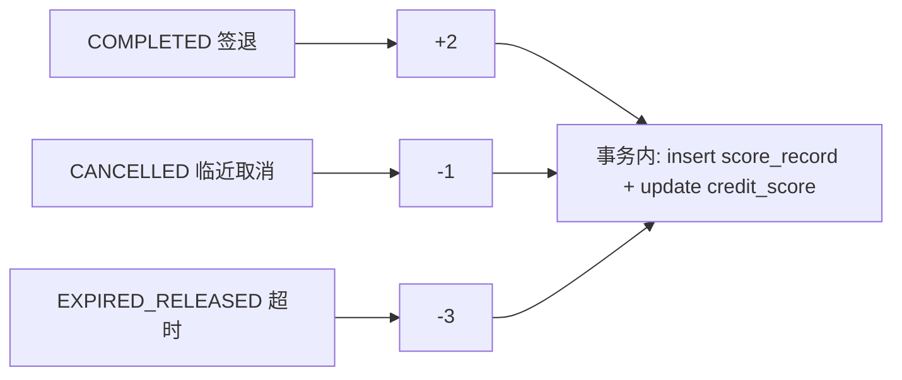

# server/09 · 积分排名设计（MVP+）

- **文档目的**：定义积分规则、流水、排行榜与防刷，明确积分为弱激励。
- **适用范围**：积分与排行榜（P7）。
- **读者对象**：后端/Agent。
- **相关文件**：[01-domain-model](01-domain-model.md)、[06-timeout-release-and-blacklist](06-timeout-release-and-blacklist.md)、[../docs/05-extension-design.md](../docs/05-extension-design.md)。

## 关键结论
- 积分**只做激励，不参与权限**；强约束是黑名单。
- 每次积分变更必须写 `score_record` 流水，`credit_score` 为累计快照。

## 一、业务目标
鼓励按时签到/离开、合理用座；对守约加分、爽约扣分；产出周/月排行榜提升活跃。

## 二、积分规则
| 事件 | 分值 | 触发点 |
| --- | --- | --- |
| 正常完成(COMPLETED) | +2 | 签退接口 **或** 自动完成任务（状态→COMPLETED，见 [06 §八](06-timeout-release-and-blacklist.md)） |
| 开始前 >30 分钟取消 | 0 | 取消接口 |
| 开始前 30 分钟内取消 | -1 | 取消接口 |
| 超时未签到 | -3 | 超时释放任务 |
| 使用后未主动签退(可选) | 可扣 | 自动完成时叠加（后续扩展，MVP 不启用） |

> COMPLETED 无论由主动签退还是自动完成产生都记 +2（均属正常结束）。「未主动签退扣分」是可叠加的后续增强规则，MVP/MVP+ 默认不启用，避免误伤正常用户。

## 三、表设计
- `score_record(id,user_id,change,reason,ref_reservation_id,created_time)`：流水。
- `sys_user.credit_score`：累计分（= 流水求和的快照，便于排行）。
`reason` 取枚举：`CHECKOUT_OK/CANCEL_LATE/NO_SHOW/NO_CHECKOUT`。

## 四、积分变更与状态机关系

积分结算挂在对应状态流转处，与预约事务一致或紧随其后（保证不漏不重）。

## 五、排行榜接口
| 接口 | 说明 |
| --- | --- |
| `GET /api/scores/me` | 本人积分 + 流水 |
| `GET /api/scores/ranking?period=week|month` | 排行榜 |
| `GET /api/admin/scores?userId=` | 管理端流水 |

排行计算：按周期内 `score_record.change` 求和排序（或用聚合缓存）。榜单可缓存 Redis 定时刷新。

## 六、防刷规则
- 积分只在**合法状态流转**时产生，不可直接调用加分接口。
- 同一预约每类事件只结算一次（幂等：按 `ref_reservation_id + reason` 去重）。
- 取消/预约频繁刷分：受单日预约次数与扣分规则自然抑制。

## 七、与黑名单关系
- 二者解耦：积分低不进黑名单，黑名单只由爽约次数触发。
- 超时未签到同时触发 `no_show_count+1`（黑名单侧）与 `-3`（积分侧），但互不为对方前置条件。

## 八、MVP+ 实现方案
- 规则硬编码为常量类；结算挂到签退/取消/超时释放。
- 排行榜先做周榜，Redis 缓存 + 定时刷新。

## 九、后续扩展
- 管理端**积分规则配置中心**（外置规则，见 [../docs/05](../docs/05-extension-design.md) G）。
- 积分兑换/等级体系（后续）。

## 实现约束
- 积分变更必留流水；结算幂等；不提供裸加分接口给客户端。

## 验收标准
- 签退 +2、临近取消 -1、超时 -3；排行榜正确；同一事件不重复结算。

## 给 AI Coding Agent 的提示
积分是 MVP+，MVP 阶段可先建表与预留结算钩子；不要让积分影响任何权限判定。
