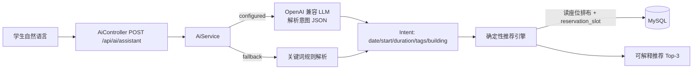

# server/14 · AI 智能选座助手设计（LLM）

- **文档目的**：定义「自然语言选座」能力——用 OpenAI 兼容大模型解析意图，用确定性引擎产出可解释的座位推荐。
- **适用范围**：学生端 AI 助手（P9 扩展落地）。
- **读者对象**：后端/前端/Agent。
- **相关文件**：[10-nearest-available-room-design.md](10-nearest-available-room-design.md)、[03-api-design.md](03-api-design.md)、[../docs/05-extension-design.md](../docs/05-extension-design.md)、[../client/05-component-design.md](../client/05-component-design.md)。

## 关键结论
- **LLM 只负责「理解 + 措辞」，不负责「可用性判断」**：座位是否空闲、能否连续坐满时长，全部由后端确定性引擎依据 `reservation_slot` 计算，杜绝模型臆造。
- **离线可降级**：未配置 `AI_API_KEY` 时自动走关键词规则解析，演示环境零依赖即可运行；配置后自动升级为大模型解析。
- **接口格式采用 OpenAI 兼容 Chat Completions**（`POST {base}/chat/completions`），可对接 OpenAI / DeepSeek / 通义千问(DashScope 兼容模式) / Moonshot 等。

## 一、能力概述
学生用一句话表达需求（时间、时长、靠窗/插座/安静/讨论等偏好、楼栋倾向），系统返回：
1. 一段自然语言回复；
2. Top-3 **可解释**推荐（座位 + 房间 + 评分 + 理由 + 标签），点击直达选座页。

示例：`我想下午2点找个安静靠窗、能连续坐两小时、最好有插座的位置`
→ 意图 `{date, start:14:00, durationSlots:4, tags:[quiet,window,power]}`
→ 推荐 `C201 考研自习室 A-01（靠窗/有插座/安静区）：连续空闲 120 分钟，周边空位率 98%`。

## 二、架构与数据流


## 三、意图模型
| 字段 | 说明 |
| --- | --- |
| date | yyyy-MM-dd，缺省今天（本地时区） |
| start | HH:mm，缺省 14:00，按 30 分钟片对齐 |
| durationSlots | 30 分钟为 1，缺省 4（=2 小时），上限 `SEATWISE_MAX_SLOTS_PER_RESERVATION` |
| tags | `window`/`power`/`quiet`/`discuss` 子集 |
| buildingHint | 楼栋关键词或空 |

**座位标签**由排布确定性派生（`SeatTags`，无需额外建表）：靠边列→`window`，偶数行→`power`，房间名含“静音/考研”→`quiet`，含“讨论”→`discuss`，首排→`near_door`。

## 四、可解释推荐评分
仅对「整段时间窗均空闲」的 `FREE` 座位打分（连续可用天然由 board 保证）：
```
score = 0.30·连续可用(=1) + 0.30·标签匹配率 + 0.20·楼栋匹配 + 0.20·周边空位率
```
- 每个房间最多取 1 个座位，跨房间取 Top-3；
- 理由清单人类可读：`连续空闲 N 分钟 / 靠窗 / 有插座 / 安静区 / 周边空位率 X%`。
- 强调**可解释**而非“AI 黑箱”：答辩表述为「可解释的多目标座位推荐」。

## 五、接口
`POST /api/ai/assistant`（登录）
请求：`{ "message": "下午2点安静靠窗坐两小时", "campusId": 1, "date": "2026-07-09" }`
响应：
```json
{ "code":"0","data":{
  "source":"rule",
  "reply":"为你推荐「C201 考研自习室」的 A-01 号座位…",
  "intent":{"date":"2026-07-09","start":"14:00","end":"16:00","durationSlots":4,"tags":["quiet","window","power"],"buildingHint":null},
  "recommendations":[{"roomId":3,"roomName":"C201 考研自习室","seatId":..,"seatNo":"A-01","start":"14:00","end":"16:00","score":0.8,"tags":["window","power","quiet"],"reasons":["连续空闲 120 分钟","靠窗","有插座","安静区","周边空位率 98%"],"availableSeats":41}]
}}
```
`source` = `llm`（走大模型）/ `rule`（离线规则）。

## 六、LLM 调用（OpenAI 兼容）
- 端点：`POST {AI_BASE_URL}/chat/completions`，Header `Authorization: Bearer {AI_API_KEY}`。
- 请求体：`{model, temperature:0.1, messages:[{role:system,意图解析指令},{role:user,原始需求}]}`。
- system 指令要求**只输出 JSON**；解析失败或超时 → 记录日志并降级规则引擎（不影响可用性）。
- 用 JDK 内置 `java.net.http.HttpClient`，无第三方 SDK 依赖，构建/离线更稳。

## 七、配置（环境变量）
| 变量 | 说明 |
| --- | --- |
| `AI_BASE_URL` | OpenAI 兼容 base（如 `https://api.deepseek.com/v1`）；空=关闭 LLM |
| `AI_API_KEY` | 密钥；空=离线规则引擎 |
| `AI_MODEL` | 模型名（如 `deepseek-chat` / `gpt-4o-mini` / `qwen-plus`） |
| `AI_TIMEOUT_MS` | 调用超时，默认 12000 |

## 八、前端
学生端全局悬浮组件 `AiAssistant.vue`（右下角 🤖）：输入需求/点击示例 → 展示回复与推荐卡片 → 点击卡片跳转 `/student/rooms/{roomId}/seats`。顶部标签显示 `大模型/规则引擎` 来源。

## 实现约束
- 推荐正确性只信后端引擎；LLM 输出仅用于意图与措辞。
- 不把密钥写进代码或前端；仅后端持有。
- 未配置密钥必须能离线演示。

## 验收标准
- 未配置 key：`source=rule`，能按“时间/时长/靠窗/插座/安静/楼栋”给出 Top-3 可解释推荐。
- 配置 key：`source=llm`，复杂/口语化表达也能正确解析意图。
- 推荐座位均为该时段真实空闲、且能连续坐满所需时长。

## 给 AI Coding Agent 的提示
扩展偏好维度时，先在 `SeatTags` 增标签并在评分中加权；不要让 LLM 直接决定座位是否可用——始终经确定性引擎核验。
