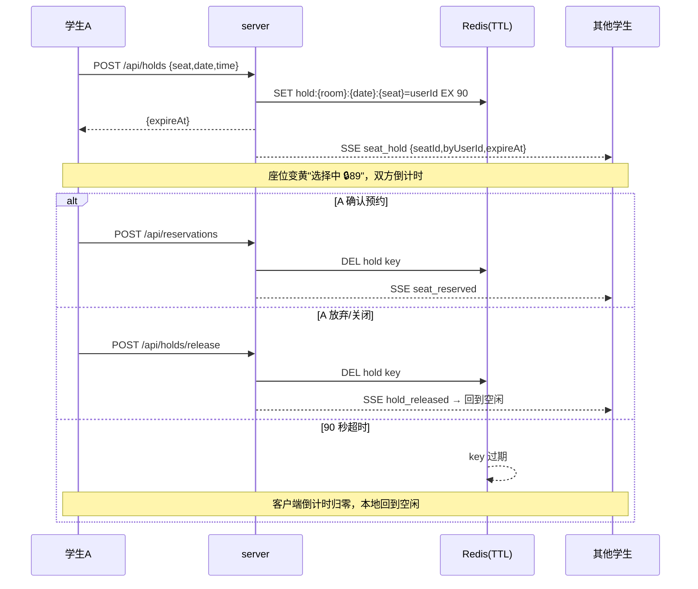

# server/15 · 临时锁座与倒计时（分布式实时特色）

- **文档目的**：定义「点座即临时保留 + 倒计时 + 到期自动释放」，把已有的分布式/实时架构真正展示出来。
- **适用范围**：学生选座页、管理端看板。
- **读者对象**：后端/前端/Agent。
- **相关文件**：[05-reservation-concurrency-control.md](05-reservation-concurrency-control.md)、[07-sse-realtime-board.md](07-sse-realtime-board.md)、[../docs/10-校园座位预约系统-改进建议.md](../docs/10-校园座位预约系统-改进建议.md) §二。

## 关键结论
- 类似购票系统：点击座位立即用 **Redis TTL** 抢占式保留（默认 90 秒），SSE 广播「正在被选择」，未在时限内确认则**自动释放**。
- **最终正确性仍由预约唯一索引兜底**：临时锁只是体验优化与冲突前移，不替代 `reservation_slot` 唯一索引。
- 到期无需服务端任务：客户端依据 `expireAt` 本地倒计时归零即视为空闲；快照读 Redis 实时反映真值。

## 一、交互流程

## 二、状态与事件
| 座位状态 | 含义 |
| --- | --- |
| `HELD` | 被临时锁定（黄色 + 🔒倒计时；`mine` 区分自己/他人） |

| SSE 事件 | payload | 说明 |
| --- | --- | --- |
| `seat_hold` | `{roomId,date,seatId,seatNo,byUserId,expireAt}` | 有人点座保留 |
| `hold_released` | `{roomId,date,seatId}` | 主动放弃/释放 |
| （复用）`seat_reserved` | 确认后座位转正式预约 |

看板快照会读取 Redis 现存锁并以 `HELD` + `heldBy` + `holdExpireAt` 返回，保证晚加入的客户端也能看到当前锁。

## 三、接口
| 方法 | URL | 权限 | 说明 |
| --- | --- | --- | --- |
| POST | `/api/holds` | STUDENT | 临时锁座，返回 `{expireAt,holdSeconds}`；他人已锁返回 `SEAT_ALREADY_HELD`；该时段已被预约返回 `SEAT_ALREADY_RESERVED` |
| POST | `/api/holds/release` | STUDENT | 释放本人锁 |

配置：`seatwise.hold-seconds`（默认 90）。

## 四、技术价值（答辩点）
- **Redisson/Redis TTL** 做临时锁与自动过期；**SSE** 推送锁定/释放；**MySQL 唯一索引**做最终兜底——三层协作在前端可见，而非仅在 PPT 里“用了 Redis 锁”。
- 冲突前移：多人几乎同时点同一座位，第二人立即看到「选择中」而非等到提交才失败。

## 实现约束
- 临时锁不参与正确性判定；确认预约仍走 [05](05-reservation-concurrency-control.md) 全流程。
- 锁到期由 Redis TTL 负责；前端倒计时到 0 本地视为空闲，避免服务端扫描。

## 验收标准
- A 点座 → B 端秒级看到「选择中」并倒计时；A 确认→B 端变已预约；A 放弃/超时→B 端回到空闲。
- 他人对同一锁定座位再次点座被拒（`SEAT_ALREADY_HELD`）。

## 给 AI Coding Agent 的提示
锁 key 为 `hold:{roomId}:{date}:{seatId}`；预约成功务必清理该 key。不要用临时锁替代唯一索引兜底。
